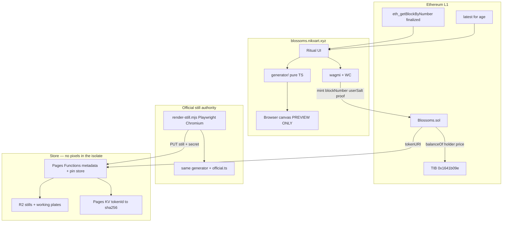
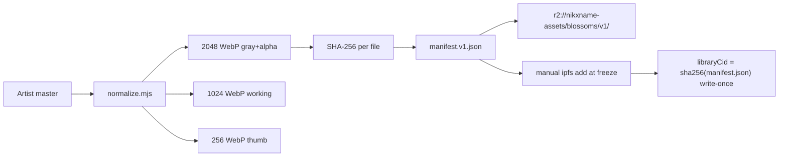
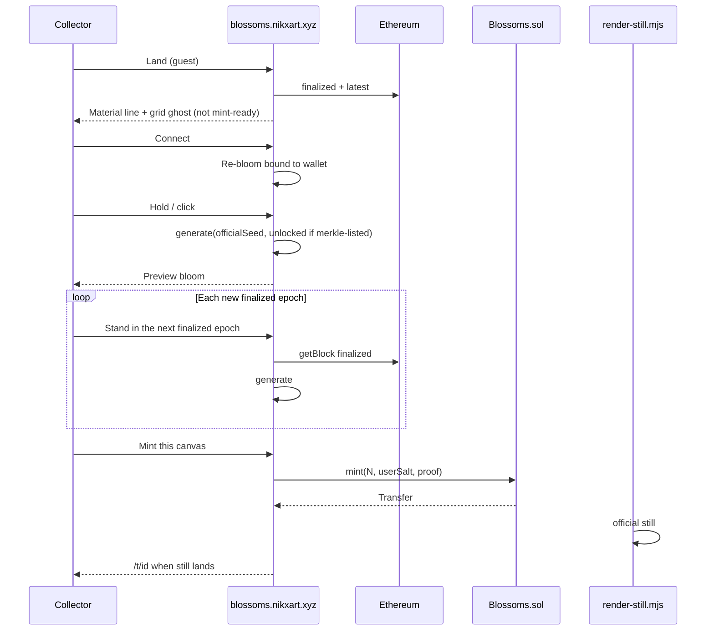

# Blossoms — Ethereum-seeded generative mint experience

| Field | Value |
| --- | --- |
| **Document** | Blossoms Design |
| **Author** | TBD (Nikxname + engineering assistant) |
| **Date** | 2026-08-15 |
| **Status** | Draft (rev 4 — artist decisions locked) |
| **Artist** | Nikxname / [nikxart.xyz](https://nikxart.xyz) / [@Nikxname](https://x.com/Nikxname) |
| **Related live work** | Together It Blooms — Collection I, *A Familiar Burn* |
| **Preferred chain** | Ethereum L1 |
| **Recommended surface** | Sibling Next.js app at `blossoms.nikxart.xyz` |

---

## Overview

Blossoms is a methodical generative-art system, not a 10k trait-layer PFP factory. The visual units are a **library of premade monochrome / grayscale blossom artworks**. A deterministic generator colorizes, grids, and arranges them using two materials the collector can feel in the room: **a finalized Ethereum block** (hash, number, timestamp, `prevrandao`) and **the collector’s own time and click**. The output is a unique canvas they may mint on Ethereum. The chain is source material, not a payment rail.

The system sits in a known lineage: Damien Hirst’s Spot Paintings (a grid of discrete units, each cell a unique color instance, the *system* as the artwork); Josef Albers’s *Interaction of Color* (simultaneous contrast, ground/figure, nested squares); named palette systems after Warhol, Hirst, and Mondrian; and the on-chain generative tradition in which a `bytes32` hash is the artwork’s genome — Autoglyphs, Art Blocks (`tokenData.hash`), Chromie Squiggles, Loot. The closest stated prior, 0xRipe’s *To Be A Machine*, is treated here as the method the artist named: Ethereum data as the “source code” that drives view, aesthetic, and palette. Public write-ups of that specific work are thin; the design follows that method and cites the public priors above.

**Recommendation in one sentence:** ship a sibling Next.js app with a pure-TypeScript deterministic generator; a **headless-Chromium official still** (browser canvas is preview-only); and a small Foundry ERC-721 on Ethereum L1 that stores `seed + libraryVersion + rendererVersion + chain material`, with write-once library/renderer CIDs and a Pages Function that serves metadata (never pixels).

This is operable by a solo artist plus a coding agent. It reuses the visual language, asset origin, and read-only chain patterns of `nikxart-puzzle` without embedding a second product inside the Together It Blooms ritual.

**v1 is a method slice, not the whole grammar.** v1 ships N = 1..4, **~16 new isolated plates**, 128 tokens, and **three public palettes** (Hirst, Albers, Mondrian) plus **Pigment** as a complete-set unlock. Warhol / Seasonal / Nocturne, N = 5..6, and most arrangements are the documented full method (`libraryVersion` 2+).

**Time box (engineering, not a drop date):** preview-only ritual in ~3 weeks; Sepolia in ~6 weeks; mainnet when 16 plates are frozen and Sepolia stills reconstruct.

---

## Background & Motivation

### Current state of the artist stack

Nikxname already ships on Ethereum via Manifold and a Next.js static site.

| Surface | Domain | Role |
| --- | --- | --- |
| Live drop | https://nikxart.xyz | 27-fragment timed mint, *Together It Blooms* |
| Finale portal | https://fragment.nikxart.xyz | Complete-set verification → still/animated Blossom claim |
| Explore | https://explore.nikxart.xyz | Full catalog / Collection Theatre |
| Assets | https://assets.nikxart.xyz | Cloudflare R2 / CDN, versioned via `SITE_ASSET_VERSION` |
| Marketplace | https://manifold.xyz/@nikxnames-art | Claims + creator contracts |

Repo: `/Users/nicholasvanniekerk/nikxart-puzzle`.

Relevant facts, not vibes:

- **Next.js 16 static export** (`next.config.js` sets `output: 'export'`) deployed to Cloudflare Pages (`wrangler.jsonc` → `pages_build_output_dir: "out"`). No origin server on the drop site. `PROTOCOLS.md`: “Static is sacred.”
- **TypeScript, Framer Motion, Cormorant Garamond**, cream/dark theme tokens in `src/styles/site.css` (`--bg:#06060a`, `--cream:#f0e8dc`, `--rose-gold:#c4a484`).
- **Manifold Connect 6.1.0 + Claims 1.16.1** loaded in `src/pages/_app.tsx` / `_document.tsx`; session bridge in `src/lib/manifoldConnect.ts` (`CONNECT_SDK_VERSION`, `CLAIM_SDK_VERSION`, WalletConnect project id, `ETH_FALLBACK_WSS`). There is **no wagmi, no Foundry, no `.sol` file** in this repo. Wallet today is Manifold OAuth (`WalletProvider` → `useManifoldWallet`). Mint today is `m-claim-buy-only`.
- **Read-only chain access** is already `viem` 2.38.0 against Ethereum mainnet: `src/lib/publicClient.ts` uses `createPublicClient({ chain: mainnet, transport: http('https://ethereum-rpc.publicnode.com'), batch: { multicall: true } })`.
- **Together It Blooms contract**: `0x1641b09e11d19e6f6b9f80273158f9da28555593` in `src/lib/contract.ts`. Drop-site ownership scan is `src/lib/ownedScan.ts` (`SCAN_MAX_ID = 1000`). Explore’s TIB row uses `scanMaxId: 1500`. Finale complete-set verification (`src/lib/setVerification.ts`) scans to **2000** and defines `completeSets = min(quantity of each piece 1..27)`. **Holder price only needs `balanceOf`.** Do not port a 1000-id scan into the mint path.
- **Mint UX today** is Manifold claim widgets (`m-claim-buy-only`) wrapped by `src/components/ManifoldBuyButton.tsx` — great for *fixed* editions, hostile to “pass a `bytes32` seed at mint.”
- **A sibling-app pattern already exists.** `explore/` is a second Next.js app in the same repo, deployed independently to `explore.nikxart.xyz` (`npm run deploy:explore`). Explore’s README is explicit: it must not touch `nikxart.xyz`.
- **“Blossom” is already a word in the finale.** `src/config/finale.ts` defines `BLOSSOM_MEDIA` (`BlossomFragments-Still.jpg`, `BlossomFragments-Animate-11K.mp4`, `BlossomFragments-Animate-4k.mp4`). `BlossomMagnifier.tsx` and `BlossomVideo.tsx` present that master. The new series must be catalogued as a **separate collection**.
- **On-chain collection registry** in `explore/config/collections.ts` spans Ethereum (The Void, Life Impressions, For You, 1/1s, A Familiar Burn) and one Base contract (`For Her..` at `0x9813ff20c99525922b3538fce8c2c9e5db93866c`). Ethereum is the home chain.
- **Gas is currently trivial on L1.** `src/hooks/useGasPrice.ts` already surfaces gwei from `cloudflare-eth.com`. As of 2026-08-15 Etherscan’s tracker is ~0.045–0.056 gwei (ETH ~$1,882). A 200–350k-gas mint is **sub-cent** at &lt;1 gwei. Revisit L2 only if median gas is **&gt; 30 gwei for a week** (then a mint is a few dollars, still not a reason to abandon L1 unless volume explodes). “Ethereum as material” does not require an L2 for cost.

### Pain this project addresses

Together It Blooms is a *slow-burn fragment puzzle*: the collector shows up for windows, the banner evolves, presence is the art. That system is complete (F27 window closed 2026-08-13; finale portal live). It cannot host a live generator without betraying its closed ritual.

Blossoms is the next method: the collector does not receive a pre-made edition. They stand in front of a system, pull a finalized epoch, click, and grow a canvas. The photographic library keeps the *hand* of the artist; the generator keeps the *method* of Hirst / Albers / on-chain generative art.

### Why not a 10k PFP factory

A trait-layer PFP samples independent layers (background, body, hat) from a spreadsheet. Blossoms samples a **single method**: grid + named color system + arrangement, all from one seed, all reconstructable. Rarity is an aesthetic event inside the method (a perfect Albers pair, a Hirst void, a 1×1 solitary), not a marketplace trait shop.

---

## Goals & Non-Goals

### Goals

1. Deterministic generator: `seed → { gridSize, cellPlacements[], paletteSystem, colors[], rarityTraits, layoutRules }` with a frozen consume order (see **Appendix A — Consume Law**).
2. Ethereum data is visible material in the piece (block number + short hash on the canvas and in metadata).
3. User time + click participate. Preview is a ritual, not a trait configurator.
4. What the collector loves is what they mint (WYSIWYG). One roll per **finalized epoch** (~6.4 min). Mint remains enabled while `blockhash(N)` is still readable on L1 (see mint clock).
5. Unique, marketplace-readable tokens on Ethereum L1 with OpenSea attributes.
6. Same seed + same `libraryVersion` + same `rendererVersion` → identical **official still** forever. The official still is produced by one named job, not the collector’s laptop.
7. Shippable v1 **method slice**: ~16 **new** isolated plates, N = 1..4, **128** tokens, **3 public palettes** (Hirst, Albers, Mondrian) plus **Pigment** unlocked for 27/27 merkle-listed wallets. The **full method** is 7 systems and N = 1..6; that is `libraryVersion` 2+, not v1.
8. Operable by one artist + a coding agent. Boring, durable tech.

### Non-goals (v1)

- Full L1 on-chain rendering of photographic blossoms (Art Blocks Engine / on-chain p5).
- Art Blocks Studio hosting, Engine partner deploy, or AB curation pipeline.
- Financial rarity, staking, royalties-as-yield, or “floor” language anywhere in the product.
- A 10k supply, reveal-after-mint, or trait-filter marketplace UX.
- Embedding the generator as routes on `nikxart.xyz`.
- Animation, audio, physical print fulfillment.
- Warhol / Seasonal / Nocturne, N = 5..6, mirrors / radial / oversized / diptych (full method, not v1). Pigment **is** v1, but only for merkle-listed complete-set wallets.
- Cloudflare Worker as a pixel renderer.
- Browser extension, mobile native app, or account abstraction.
- Cross-chain mint, Base default, or L2 “gasless” mint.
- Continuously refreshed complete-set Merkle (snapshot at `mintOpen` only).

---

## Key Decisions

| Decision | Choice | Rationale |
| --- | --- | --- |
| **Product surface** | Sibling Next.js app `blossoms/` in the nikxart-puzzle monorepo, custom domain `blossoms.nikxart.xyz` | `explore/` already proved this pattern. Together It Blooms is a closed ritual; do not hang a generator off it. Independent deploy = independent blast radius. |
| **Chain** | Ethereum L1 | Artist’s body of work is L1 (only *For Her..* is on Base). “ETH as material” is conceptually L1. A mint is **sub-cent at &lt;1 gwei**; revisit Base only if median **&gt; 30 gwei for a week** *and* volume demands it. |
| **Contract** | Dedicated Foundry ERC-721 (`Blossoms.sol`), not Manifold Claims, not Art Blocks, not a Creator-Core extension in v1 | Claims widgets cannot carry a verified seed. Art Blocks cannot host a photographic library on L1 cheaply. A Creator-Core **custom minter extension** is a real middle path (Alternative 7) — still new Solidity, plus Manifold metadata/indexer coupling. Standalone 721 keeps `TokenRecord` and seed verification in one file we can `forge test` against TS vectors. |
| **Wallet** | **New** wagmi + viem + WalletConnect for mint. Clone `publicClient.ts` and the *idea* of `ownedCache.ts`. **Do not clone** `WalletProvider` / `useManifoldWallet` / `WalletButton` (those are Manifold OAuth). Skin a new connect control as a visual cousin. | Custom calldata does not fit `m-claim-buy-only`. There is no wallet stack in-repo to reuse beyond viem reads. |
| **Mint clock** | Preview on **`finalized`**. Re-roll when `finalized.number` advances (an **epoch**, ~6.4 min, never “next block”). UI expiry = `blockhash` still readable: warn at `latest − N ≥ 200`, hard-disable at `latest − N ≥ 240`. Contract cap `latest − N ≤ 256`. | `finalized` already lags `latest` by ~64–96 slots. A 64-block UI target would expire every preview at roll time. Remaining window at roll is ~30+ minutes. Copy: “Stand in the next finalized epoch.” |
| **WYSIWYG + anti-grind** | Preview **is** the mint. No mint-time `prevrandao`. Epoch-gated rolls, not instant rerolls. | Matches “if they love it, mint.” Waiting on finality is the anti-grind. |
| **Seed ABI** | `keccak256(abi.encode(keccak256("nikx.blossoms.v1"), bh, userSalt, msg.sender))` in both languages. `userSalt` is **opaque** to the contract. | One genome. No `encodePacked` domain, no `bytes32("nikx.blossoms.v1")` padding games. |
| **Official still** | **Node + headless Chromium** (`blossoms/scripts/render-still.mjs`, Playwright — already a root devDependency) is the only official still. Browser canvas is **preview-only**. Pages Functions never run a pixel loop. | Browser `putImageData` → PNG is not byte-identical across engines. A client pin is a snapshot, not `render(seed, library, renderer)`. |
| **Version pins** | `TokenRecord` stores `libraryVersion` **and** `rendererVersion`. `libraryCid[v]`, `libraryUri[v]`, `rendererCid[v]` are **write-once** (`if (set) revert`). | Goal 6 is a function of three on-chain integers + two CIDs, not an owner policy. |
| **Nmax** | **v1: 4.** Full method: 6. | 16 photographic cells still read as units. Cuts render cost and library pressure for a solo season. `libraryVersion` 2 may raise Nmax without rewriting v1 tokens. |
| **v1 systems** | **Hirst, Albers, Mondrian** public; **Pigment** unlockable for 27/27 merkle-listed wallets | Artist locked a hidden fourth system. Pigment is the most “secret print” of the full-method set and does not require Warhol’s serial plate. |
| **Unlock input** | `generate(..., unlocked)` is **not** in the seed. Stored as `TokenRecord.flags` bit 0. Any mint by a merkle-listed wallet (first paid *or* free extra) may roll Pigment. | Merkle tree will not exist forever in the client; the flag reconstructs the picture. Consume count is identical locked vs unlocked (always pick 4, maybe overwrite). |
| **Renderer primitive** | Canvas2D + `putImageData` in the official Chromium job. Preview may use the same module in-browser. CSS `mix-blend` is preview chrome only. | Colorization is a 2D image op. WebGL varies by GPU. |
| **Color space** | OKLCH, vendored Ottosson 2020 conversion with a locked test vector | Albers is about perceived relation. Do not RGB-lerp. Do not pull all of `culori` into the pixel loop. |
| **Rarity posture** | Aesthetic frequencies, unpublished in the UI as odds. v1 constructed events sized so E[count] ≥ 2 at **128** (flags are 1/8 of parent). Hunting = waiting on finalized epochs, WYSIWYG. | On-chain keccak is not a casino RNG. 1/16-of-parent ghosts at 128 (Spectrum E would be ~1.3). |
| **Edition** | Capped **128** (artist locked) | One tight season. `getStaticPaths` / `MAX_SUPPLY` / `/t` `/live` are `1..=128`. |
| **Mint rights** | First token: 1/wallet at public or holder price. Merkle 27/27: **one additional** at 0, `mintedBy <= 2`. Merkle root **must** be set before `mintOpen` (palette gate). | Encoded in the contract, not a boolean that stays true. |
| **Price** | **0.027 ETH** public; **0.014 ETH** if `TIB.balanceOf > 0`; **0 ETH** for the merkle extra only (artist locked) | Poetic numbers (27 fragments). `setPrices` still exists before `mintOpen` for emergencies; this is the product. |
| **Plates** | **~16 new isolated grayscale+alpha plates** the artist will prepare. Not recuts of `BlossomFragments-Still`. Placeholders until delivery. | Finale still is a finished composition; the library is a typecase. |
| **Owner reserve** | **8** (`6.25%` of 128) | Keep 8. Tightening to 4 is unnecessary; these are artist/museum proofs. |
| **Permanence** | On-chain: seed, versions, write-once `sha256(manifest.json)` + `libraryUri` + `rendererCid`. Official still: R2 + one manual `ipfs add` at library freeze. Dual-pin is a **launch checklist**, not a runtime. | Reconstructable if the site dies. R2 is the fast path. |
| **Pin vendor** | R2-authoritative stills; **Pinata** (or successor) only as a manual freeze pin of library + renderer. Pages Function does not call a pin SaaS on every mint. | Those services churn. Do not make mint depend on them. |
| **Naming vs finale** | Collection title **Blossoms**; finale claim remains “Blossom Fragments Still / Animated” | Same metaphor, different tokens. |
| **Owner key / royalty** | Constructor args. Default: dedicated deployer EOA or Safe as `owner`; royalty receiver = the same payout address the artist already uses for Manifold creator earnings (not in repo — confirm at deploy). ERC-2981 7.5%. | Do not hard-code an address we do not have. |

---

## Proposed Design

### Placement relative to nikxart-puzzle

```
nikxart-puzzle/                     # existing monorepo
  src/ …                            # nikxart.xyz — do not add Blossoms routes
  explore/                          # explore.nikxart.xyz
  blossoms/                         # NEW — blossoms.nikxart.xyz
    src/
      generator/                    # pure TS: seed, PRNG, consume law, systems
      render/                       # official.ts (used by Chromium job + preview)
      components/                   # ritual UI
      lib/                          # viem client, wagmi, contract ABI
      pages/
        index.tsx
        t/[id].tsx                  # getStaticPaths 1..128
        live/[id].tsx               # getStaticPaths 1..128
    functions/api/                  # Pages Functions: metadata + pin store ONLY
      token/[id].ts
      seed/[id].ts
      pin.ts
    scripts/
      normalize.mjs
      render-still.mjs              # official still (Playwright Chromium)
      snapshot-tib-sets.mjs         # 27/27 merkle, reuses setVerification semantics
    contracts/                      # Foundry
    public/
```

**Why A (sibling app), not B (routes) or C (Art Blocks):**

| Option | Verdict |
| --- | --- |
| **A. Sibling Next.js app** | **Primary.** Same as `explore/`: own domain, own deploy, shared visual DNA, no risk to the drop site. |
| **B. Routes on nikxart.xyz** | Reject for v1. `src/pages/index.tsx` is a timed ritual with lockdown/portal. A generator would collide with finale IA, Manifold script budget, and `PROTOCOLS.md`. |
| **C. Art Blocks / full on-chain script** | Reject as primary. A photographic library is megabytes of raster. Engine Flex + IPFS is a later port, not v1. |

Reuse, do not rewrite:

| Existing | How Blossoms uses it |
| --- | --- |
| `src/styles/site.css` tokens, Cormorant, grain, rose-gold CTAs | Copy the token block into `blossoms/src/styles/`. Do not import CSS across apps (explore doesn’t either). |
| `src/lib/publicClient.ts` | **Clone** as `blossoms/src/lib/publicClient.ts`; add `getBlock({ blockTag: 'finalized' })` and `getBlock({ blockTag: 'latest' })`. |
| `src/lib/ownedCache.ts` | **Clone the cache idea** for TIB `balanceOf` only. |
| `src/lib/contract.ts` | TIB address + `balanceOf` ABI. Do not clone `ownedScan.ts` into the ritual path. |
| `src/lib/setVerification.ts` | Reuse **semantics** (`completeSets = min(qty of pieces 1..27)`) in `scripts/snapshot-tib-sets.mjs`. Scan max 2000, not the drop site’s 1000. |
| `src/lib/manifoldConnect.ts`, `WalletProvider`, `WalletButton` | **Do not clone.** New wagmi connect, visually cousin to the rose-gold pill. |
| `src/hooks/useGasPrice.ts` | Clone; show gwei near mint. |
| `src/lib/metadata.ts` | Clone `resolveTokenUri` for token pages. |
| `SITE_ASSET_VERSION` in `artist.ts` | `LIBRARY_ASSET_VERSION` for R2 working assets. Official still keys by `rendererVersion` + seed, not this string. |
| `assets.nikxart.xyz` | `https://assets.nikxart.xyz/blossoms/v1/…` |
| `functions/api/download.ts` | **Pattern for Pages Functions as fetch/JSON proxies.** Not a renderer. Blossoms Functions live at `blossoms/functions/api/…` so they deploy with the Pages project the way the drop site already does. |
| `explore/` five-step registry | After token 1 exists (PR 12c). Not a one-row `collections.ts` edit. |
| `@playwright/test` / sharp (root) | Official still job + library normalize. |

### Architecture



### 1. Generation model (the artwork)

This is closer to Autoglyphs / Art Blocks / Chromie Squiggles than to a PFP factory because:

1. **One hash is the genome.** Traits are not independently rolled in a JSON table and composited.
2. **The chain is an input, not a receipt.** The finalized block hash is printed on the canvas.
3. **The official still is a function**, not a Photoshop file: `officialStill(seed, libraryVersion, rendererVersion)`.
4. **The artist authors a method**, not 10,000 layered PNGs.

#### Seed composition

Two layers, one official genome.

**Material** (shown in the UI, stored on the token):

| Field | Source | Role |
| --- | --- | --- |
| `chainBlockNumber` | Latest **finalized** block at roll time (`eth_getBlockByNumber("finalized")`) | Provenance; contract verifies `blockhash` |
| `chainBlockHash` | That block’s `hash` | Primary chain entropy |
| `prevrandao` | That block’s `prevrandao` | Displayed; mixed into **client** `userSalt` only |
| `blockTimestamp` | That block’s `timestamp` | The piece’s “hour” |
| `wallet` | `msg.sender` at mint | Binds the canvas to a person |
| `clickAtMs` | `Date.now()` at pointer-up | User time |
| `pointerX`, `pointerY` | Quantized int16 in `[-10000, 10000]` | User body |
| `rollNonce` | Increments when `finalized.number` advances | Prevents same-epoch spam |

**`userSalt`** is computed **only on the client**. The contract treats it as an opaque `bytes32`. It does **not** recompute click/pointer/`prevrandao`.

```ts
import { encodePacked, keccak256 } from 'viem';

export function makeUserSalt(input: {
  clickAtMs: bigint;
  pointerX: number;
  pointerY: number;
  rollNonce: number;
  prevrandao: `0x${string}`;
}): `0x${string}` {
  return keccak256(
    encodePacked(
      ['string', 'uint64', 'int16', 'int16', 'uint32', 'bytes32'],
      [
        'nikx.blossoms.salt.v1',
        input.clickAtMs,
        input.pointerX,
        input.pointerY,
        input.rollNonce,
        input.prevrandao,
      ],
    ),
  );
}
```

#### Official seed (canonical — the only formula)

Solidity:

```solidity
bytes32 seed = keccak256(
    abi.encode(
        keccak256("nikx.blossoms.v1"),
        blockhash(chainBlockNumber),
        userSalt,
        msg.sender
    )
);
```

TypeScript (must match **byte-for-byte**):

```ts
import { encodeAbiParameters, keccak256, toBytes } from 'viem';

export function officialSeed(args: {
  blockHash: `0x${string}`;
  userSalt: `0x${string}`;
  account: `0x${string}`;
}): `0x${string}` {
  return keccak256(
    encodeAbiParameters(
      [
        { type: 'bytes32' },
        { type: 'bytes32' },
        { type: 'bytes32' },
        { type: 'address' },
      ],
      [keccak256(toBytes('nikx.blossoms.v1')), args.blockHash, args.userSalt, args.account],
    ),
  );
}
```

**Deleted variants:** `abi.encodePacked`, `bytes32("nikx.blossoms.v1")`, hashing the domain in one language and not the other. PR 2’s first fixture is this encoding against a known `(bh, salt, addr)` tuple; PR 8b fails the merge if Foundry disagrees.

#### Preview vs committed

| Mode | `account` in `officialSeed` | What the collector sees |
| --- | --- | --- |
| Guest | *not used* | **No mint-ready image.** Grid ghost + material line + “Connect to grow *your* canvas from this epoch and click.” A guest study may run `generate` with `address(0)` behind a “study” label, but it is not presented as the token. |
| Bound preview | connected wallet | The picture they can mint, for as long as `blockhash(N)` is readable. |
| Mint | `msg.sender` | Contract recomputes `seed` from `(chainBlockNumber, userSalt, msg.sender)`. Frozen. |

On connect: **re-bloom** from the same finalized block + a new `userSalt` (same click if still held, or a fresh hold). Do **not** imply the guest study persists. Including `msg.sender` in the genome is the correct anti-theft choice; the UX must not lie about it.

There is **no second entropy at mint**. Mixing mint-block `prevrandao` would destroy WYSIWYG.

#### Mint clock (finalized vs latest)

Post-Merge, `finalized` lags `latest` by about **two epochs** (~64–96 slots, ~12.8–19.2 min). `finalized.number` advances by **32** about every **~6.4 minutes**, not every 12s block.

`blockhash(N)` (the opcode the v1 contract uses) is only available for the last **256** blocks (~51 min).

| Quantity | Value | Notes |
| --- | --- | --- |
| `age_at_roll` | `latest − finalized ≈ 64–96` | Already elapsed when they click |
| Remaining opcode window at roll | ~160–192 blocks ≈ **32–38 min** | This is the real mint window |
| `ui_warn_at` | `latest − N ≥ 200` | “This epoch is aging — mint or stand again” |
| `ui_hard_expire_at` | `latest − N ≥ 240` | Disable Mint; force a new epoch |
| `contract_max` | `block.number − N ≤ 256` and `blockhash(N) ≠ 0` | Hard revert `BlockhashExpired` |

Copy:

- Wait label: **“Stand in the next finalized epoch”** (~6.4 min). Never “next block.”
- Material line shows both `#finalized` and age vs `latest`.

**EIP-2935 is live** (Pectra, May 2025). The history contract serves ~8191 hashes (~27h). The `BLOCKHASH` opcode is still a 256-window; older hashes require the system contract. **v1 still uses the 256-opcode window** so the contract stays small. A v2 minter may read the history contract without changing minted seeds.

#### Determinism guarantee

```
officialStill = chromiumJob( generate(seed, libraryVersion), rendererVersion )
```

- `seed`, `libraryVersion`, `rendererVersion` are on-chain per token.
- `libraryCid[v] = sha256(manifest.json)` write-once, plus write-once `libraryUri[v]` (`ipfs://…` or `ar://…`).
- `rendererCid[v]` write-once (digest of the renderer bundle the job runs).
- Marketplace `image` is a **pin of that official still**. `animation_url` (`/live/:id`) must dispatch the **same** `rendererVersion`. If they ever diverge, **the still wins for provenance**.
- **Do not** lazy-re-render in a different runtime (not in a Worker, not in the collector’s browser) to fill `image`.

#### PRNG

No `Math.random()`. **sfc32**, two streams:

- Stream A (layout): seed bytes 0–15 as four `uint32` LE.
- Stream B (color): seed bytes 16–31.

API:

```ts
nextU32(): number        // [0, 2^32)
next01(): number         // nextU32() / 2**32, never 1
```

Weighted picks use **integer weights** and `nextU32() % W` with subtract-walk (Appendix A). Changing consume order is a new `libraryVersion`.

```ts
export const DOMAIN = 'nikx.blossoms.v1' as const;
export const N_MIN = 1;
export const N_MAX_V1 = 4;
export const N_MAX_FULL = 6;

export type PaletteId =
  | 'hirst'
  | 'albers'
  | 'mondrian'
  | 'warhol'
  | 'seasonal'
  | 'nocturne'
  | 'pigment';

export type ArrangementId =
  | 'field'
  | 'solitary'
  | 'checker'
  | 'void-cell'
  | 'all-one'
  | 'radial'
  | 'mirror-x'
  | 'mirror-y'
  | 'quad'
  | 'oversized'
  | 'diptych';

export type Cell = {
  x: number;
  y: number;
  blossomId: string | null;
  rot: 0 | 90 | 180 | 270;
  flipX: boolean;
  flipY: boolean;
  span: 0 | 1 | 2; // 0 = hole covered by a span-2 origin; 1 = single; 2 = 2×2 origin
  crop: 'circle' | 'square' | 'silhouette';
  color: { l: number; c: number; h: number };
  ground?: { l: number; c: number; h: number };
};
```

`libraryVersion === 1` emits palettes `{hirst, albers, mondrian}` for everyone and `{pigment}` only when `unlocked === true`. Arrangements `{field, solitary, checker, void-cell}`. Other enum members exist so v2 does not rename the type.

```ts
export const FLAG_UNLOCKED = 1 << 0;

export function generate(args: {
  seed: `0x${string}`;
  libraryVersion: number;
  rendererVersion: number;
  unlocked: boolean; // TokenRecord.flags & FLAG_UNLOCKED; NOT part of the seed
  material: {
    chainBlockNumber: number;
    chainBlockHash: `0x${string}`;
    wallet: `0x${string}`;
  };
}): Generation;
```

**Grind posture:** keccak(blockhash, salt, sender) is adversarial-weak. Waiting on attractive **finalized epochs** is allowed and is the locked product (WYSIWYG). Instant rerolls are not. UI shows trait **names**, not odds. Never say “provably fair.”

### 2. Grid system

**Nmax v1 = 4.** Full-method Nmax remains 6 (Hirst can pack spots; these cells are artworks — 6 is the largest N that still feels like a spot painting of paintings). v1 cuts to 4 so 16 plates and a Chromium still job stay honest on mid-mobile.

**v1 N table** (stream A step 1; integer weights sum to 100):

| N | Weight | Feel |
| --- | --- | --- |
| 1 | 8 | Solitary portrait. Arrangement overwritten to `solitary`. |
| 2 | 16 | Pair. Intimate. |
| 3 | 36 | Standard small canvas. |
| 4 | 40 | Default field. |

**Full-method N table** (`libraryVersion` ≥ 2; weights sum to 100):

| N | Weight |
| --- | --- |
| 1 | 6 |
| 2 | 12 |
| 3 | 24 |
| 4 | 28 |
| 5 | 18 |
| 6 | 12 |

Do **not** draw N uniformly.

**Layout geometry** (official export 2400×2400, 1:1):

```
canvas = 2400
margin = round(canvas * 0.06)                    // 144
inner  = canvas - 2 * margin
gutterRatio =
  mondrian ? 0.055 :
  albers   ? 0.028 :
  hirst    ? 0.022 :
             0.018
cellPitch = inner / N
gutter = round(cellPitch * gutterRatio)
cell   = cellPitch - gutter
```

**Crop per system**

| System | Cell crop | v1? |
| --- | --- | --- |
| Hirst | `circle` | yes |
| Albers | `square` nested | yes |
| Mondrian | `square` flush | yes |
| Warhol | `square` inset 4% | full method |
| Seasonal / Nocturne / Pigment | `silhouette` | full method |

**Extensibility:** tokens store `libraryVersion` + `rendererVersion`. v1 freezes `N_MAX = 4` and the v1 tables inside `generator/v1.ts`. v2 may add N = 5..6 (or 7..8 later). Already-minted v1 tokens never pass through v2 layout. **Do not store `gridN` on-chain in v1** — tokenURI attributes are enough; the seed is the source of truth.

### 3. Blossom library

#### Catalog assumption

**v1 ships ~16 new isolated grayscale+alpha plates** the artist will prepare (range 12–20 acceptable; 16 keeps integer weights simple). **Not recuts** of `BlossomFragments-Still`. Engineering uses placeholders until delivery. The finale still is a finished composition; the library is a typecase.

#### Asset pipeline



`blossoms/scripts/normalize.mjs` (sharp is already a root `devDependency`):

1. Resize longest side to 2048, contain, no upscale past native.
2. Linear luminance `Y = 0.2126 R + 0.7152 G + 0.0722 B` after sRGB linearize.
3. Single-channel + keep alpha. Prefer hand-cut alphas.
4. WebP q=86 lossless-alpha + PNG fallback.
5. SHA-256 the 2048 WebP; record in the manifest.
6. Refuse to overwrite an existing `id` without `--bump-version`.

Manifest:

```json
{
  "libraryVersion": 1,
  "rendererCompat": [1],
  "count": 16,
  "blossoms": [
    {
      "id": "b01",
      "file": "b01.webp",
      "sha256": "…64 hex…",
      "w": 2048,
      "h": 2048,
      "silhouette": "full",
      "weight": 1
    }
  ]
}
```

`weight` is an **integer**. On-chain `libraryCid[1] = sha256(bytes of manifest.v1.json)` (raw 32-byte digest, not a multibase CID). `libraryUri[1]` is the full `ipfs://…` or `ar://…` string, also write-once.

Live URLs:

- Working: `https://assets.nikxart.xyz/blossoms/v1/work/b01.webp`
- Master: `https://assets.nikxart.xyz/blossoms/v1/master/b01.webp`

The generator addresses blossoms by **`id`**. Replacing a file without a version bump is forbidden. Minted tokens keep the original CID.

#### Cell pick rules

Always consumed per cell (Appendix A), then occupancy may overwrite:

- With replacement, integer library weights.
- Rotation table 70 / 12 / 12 / 6.
- `flipX` if `nextU32() % 100 < 8`; `flipY` if `nextU32() % 100 < 4` (independent; both ≈ 0.32%).
- Mondrian emptiness is a **per-cell Bernoulli** (`emptyU % 100 < 35`), not an exact 35% count. Always consume `emptyU` even on non-Mondrian (discard).

v1 arrangement overwrites (no extra consume except the always-on index draws):

- `checker`: even cells keep first drawn id of (0,0); odd cells keep first drawn id of the first odd cell. All cell draws still happen.
- `void-cell`: `cells[voidIndex].blossomId = null`.
- `solitary`: only (0,0) exists.

Full-method overwrites (`all-one`, mirrors, radial, oversized, diptych) belong to `libraryVersion` ≥ 2 and have their own consume law. **v1 does not pre-consume v2 draws.** `soliIndex` is a v1 draw because Mondrian Solitaire (a v1 color event) uses it.

### 4. Color systems

Palette is a named discrete system, never `rgb(random,…)`.

#### v1 selection (stream A step 2; weights sum to 100)

Always pick from **four** weights. If the wallet is not unlocked, overwrite Pigment → Hirst (no extra consume).

| System | Weight | Notes |
| --- | --- | --- |
| Hirst | 36 | Pharmaceutical field |
| Albers | 28 | Nested grounds |
| Mondrian | 22 | Primaries + empty fields |
| Pigment | 14 | Unlock only. Locked tokens still *draw* this slot, then overwrite to Hirst. |

Realized frequencies if **locked** (Pigment remapped to Hirst): Hirst 50 / Albers 28 / Mondrian 22. If **unlocked**: as drawn (36 / 28 / 22 / 14).

#### Full-method selection (`libraryVersion` ≥ 2; weights sum to 100)

| System | Weight |
| --- | --- |
| Hirst | 26 |
| Warhol | 16 |
| Albers | 16 |
| Seasonal | 14 |
| Mondrian | 12 |
| Nocturne | 10 |
| Pigment | 6 |

Warhol (full method) overwrites arrangement to `all-one` **after** the arrangement draw is consumed.

#### OKLCH convention

Internal colors `{ l: 0..1, c: 0..0.4, h: 0..360 }`. Convert to sRGB only at `putImageData`. Gamut map by reducing `c` until in-gamut (no RGB clip).

`generator/oklch.ts` is a **vendored Björn Ottosson 2020** conversion (≤ ~50 lines), not a `culori` import. Locked test vector (must sit in PR 2):

- OKLCH `{ l: 0.5, c: 0, h: 0 }` → sRGB `{ r: 0.461, g: 0.461, b: 0.461 }` ± 0.002 (neutral mid-grey).
- Cite: Björn Ottosson, “A perceptual color space for image processing” (2020).

#### Colorization

Source pixel: grayscale + alpha. `t ∈ [0,1]` (1 = paper, 0 = ink).

**Albers always uses a three-stop map** (ink → mid → paper). All other systems use two-stop duotone (ink → paper).

```ts
function colorizeDuotone(t: number, ink: Oklch, paper: Oklch): Oklch { /* shortest-arc hue lerp */ }

function colorizeThreeStop(t: number, ink: Oklch, mid: Oklch, paper: Oklch): Oklch {
  return t < 0.5
    ? colorizeDuotone(t * 2, ink, mid)
    : colorizeDuotone((t - 0.5) * 2, mid, paper);
}
```

Do **not** use `multiply` as the official path. Preview animation may cheat with CSS filters; the official still may not.

#### Hirst — pharmaceutical spots (v1)

- 12 hue buckets of 30°.
- Occupied cell: `L ∈ [0.55, 0.75]`, `C ∈ [0.18, 0.28]`, hue = bucket center + `(nextU32() % 24)` degrees.
- **Adjacency:** 4-neighbor cannot share a bucket. **Fixed consume:** always draw **16** bucket candidates per cell; take the first that does not conflict with already-assigned N and W neighbors; if none, take candidate 16. No variable retry count.
- Paper / canvas ground: `{ l: 0.97, c: 0.01, h: 90 }`. No grid lines.

**Void Spot (redefined — construct, do not search):**

- Eligible: `palette === hirst && N >= 2` and stream-B flag (`uVoid % 8 === 0`, 1/8 of Hirst).
- Cell `voidIndex` (already consumed on stream A) is achromatic: `C = 0`, `L` is 0.12 (ink-black) or 0.97 (paper) from `voidInkU % 2`.
- Remaining occupied cells keep the default 4-neighbor unique-bucket assignment. Distinct-bucket target is `min(occupied - 1, 12)` — **not** “15 unique hues.” The 12-bucket wheel cannot supply 15 families.
- Trait: `Hirst Void`.

**Spectrum (v1, N = 4 only):**

- Eligible: `palette === hirst && N === 4` and stream-B flag (`uSpec % 8 === 0`, 1/8 of those).
- Always Fisher–Yates shuffle 12 buckets, flag on or off, with **exactly 11** `nextU32` consumes:

```ts
for (let i = 11; i >= 1; i--) swap(i, B.nextU32() % (i + 1));
```

  If the flag is on, assign that permutation to the first 12 occupied cells in row-major order, then paint the rest with the default 16-candidate path **using the already-drawn candidates** (no extra consume). Do not write a 12-iteration form (the `i === 0` swap is a no-op and would shift the rest of stream B by one word).
- Trait: `Hirst Spectrum`.

#### Albers — Interaction of Color (v1)

Real Albers: a color is a relation. Simultaneous contrast; nested grounds.

- Canvas ground G0; each cell nested G1 / G2; blossom three-stop toward G2.
- Two parent hues `H` and `H+δ`, `δ ∈ {18, 30, 45, 180}` (index `nextU32() % 4`).
- All grounds/inks are mixtures of those two plus L shifts.

**Perfect Pair** (`uPair % 8 === 0`, 1/8 of Albers): constructed from the same stream-B draws as the default Albers path (no extra consume). Trait: `Albers Perfect Pair`. Geometry is specified **only** in Appendix A (N=1 nested halves vs N≥2 two-cell copy). Do not invent a third picture.

#### Mondrian — neoplastic (v1)

Locked OKLCH:

- red `{l:0.55,c:0.22,h:25}`
- yellow `{l:0.88,c:0.18,h:95}`
- blue `{l:0.45,c:0.16,h:260}`
- black `{l:0.12,c:0,h:0}`
- white `{l:0.97,c:0,h:0}`
- grey `{l:0.62,c:0,h:0}` included when `greyU % 5 === 0` (20% of Mondrian rolls; always consume `greyU`).

Heavy black grid. Per-cell Bernoulli `emptyU % 100 < 35` → `blossomId = null`. Occupied: ink is black or the cell primary; paper white.

**Solitaire** (`uSoli % 8 === 0`, 1/8 of Mondrian): exactly one blossom at `soliIndex`; every other cell is an empty primary field. Always consume `soliIndex`. Trait: `Mondrian Solitaire`.

#### Pigment — complete-set unlock (v1, hidden)

Single-pigment print. One hue for the whole canvas; only L (and a whisper of C) varies. Reads as a cyanotype / rose madder / iron-gall plate of the grid. Silhouette crop. Gutter ratio `0.018`. Two-stop duotone (not three-stop).

**Access (locked product):**

- `unlocked = (TokenRecord.flags & FLAG_UNLOCKED) !== 0`.
- At mint, `FLAG_UNLOCKED` is set if `_merkleListed(msg.sender, merkleProof)` — **any** mint by a 27/27 wallet, including the paid first token. The free extra is not the only door.
- Preview: if the connected wallet has a merkle proof against the published root, call `generate({ ..., unlocked: true })`. Guests and non-listed wallets preview locked.
- Official still / `/live/:id` read `flags` from chain. They do **not** re-check the merkle tree.
- Merkle root **must** be on-chain before `mintOpen`. A later snapshot cannot rewrite minted flags.

**Algorithm (always consume these stream-B words, even when locked / not Pigment):**

- `pigmentH = (B.nextU32() % 3600) / 10` — hue degrees.
- `uUncolored = B.nextU32() % 8`.
- Ink `{ l: 0.22, c: 0.08, h: pigmentH }`, paper `{ l: 0.93, c: 0.02, h: pigmentH }`. Canvas ground = paper.
- If `palette === 'pigment' && uUncolored === 0`: force `c = 0` on ink and paper (pure greyscale library). Trait: `Uncolored`.

`Uncolored` is a Pigment-only constructed flag. Its parent population is merkle-listed mints, not 128, so it is **not** sized to E≥2 over the whole edition. The felt reward is the **Pigment palette** (`Palette: Pigment` + `Unlock: Complete Set`). Do not print odds.

#### Full-method systems (not v1)

Documented so Season 2 does not invent them under pressure. v1 `generate()` does **not** emit Warhol / Seasonal / Nocturne.

- **Warhol** — one blossom, split-complementary circuit, high C. Fluoro: C at gamut edge, one cell inverted.
- **Seasonal** — analogous 40° window; season from `nextU32() % 4`. Equinox: split canvas.
- **Nocturne** — low-C indigo/umber ground. Streetlamp is an undocumented easter egg.

#### v1 constructed events (sized for 128)

Flags are `nextU32() % 8 === 0` (**1/8 of parent**). Keeping 1/16 would ghost Spectrum at 128 (E≈1.3 even before Pigment remaps Hirst).

Use **locked** realized palette weights as the conservative public baseline (Pigment overwritten to Hirst): `P(H)=0.50`, `P(A)=0.28`, `P(M)=0.22`, `P(N≥2)=0.92`, `P(N=4)=0.40`.

| Event | Predicate | P(overall, locked) | E[count] @ 128 | Trait |
| --- | --- | --- | --- | --- |
| Albers Perfect Pair | Albers ∧ uPair=0 | 0.28 × 1/8 = **0.035 ≈ 1/28.6** | **4.48** | `Albers Perfect Pair` |
| Hirst Void | Hirst ∧ N≥2 ∧ uVoid=0 | 0.50 × 0.92 × 1/8 = **0.0575 ≈ 1/17.4** | **7.36** | `Hirst Void` |
| Hirst Spectrum | Hirst ∧ N=4 ∧ uSpec=0 | 0.50 × 0.40 × 1/8 = **0.025 = 1/40** | **3.20** | `Hirst Spectrum` |
| Mondrian Solitaire | Mondrian ∧ uSoli=0 | 0.22 × 1/8 = **0.0275 ≈ 1/36.4** | **3.52** | `Mondrian Solitaire` |

If many tokens are unlocked, Hirst’s realized weight falls toward 36% and Spectrum E toward **2.30** (still ≥ 2). Pigment itself is the unlock trait; do not promise a collection-wide count.

These are PRNG weights, not VRF. Do not print them on the site. Do not use them as investment language.

**Not in the v1 trait list:** Bloom White, Streetlamp, Warhol Fluoro, Equinox. Stream B still consumes `uEgg = nextU32() % 256`. `Uncolored` **is** a v1 trait when Pigment lands.

### 5. Arrangement rarity

**Always consume** the arrangement draw, then maybe overwrite (Appendix A).

**v1 arrangement draw table** (weights sum to 100). `solitary` is never drawn; N=1 **overwrites** after the consume:

| Arrangement | Weight | Rule |
| --- | --- | --- |
| `field` | 70 | Independent cell picks |
| `checker` | 18 | Two blossoms (even/odd `x+y`) |
| `void-cell` | 12 | Exactly one empty cell at `voidIndex` |

Then: `arrangement = gridN === 1 ? 'solitary' : arrangementDrawn`. Realized ~8% of tokens are 1×1 and therefore `Solitary`. On N≥2, `solitary` is not a drawn enum. Mondrian Solitaire is a **color-system** event (stream B), not an arrangement.

**Full-method arrangement table** (`libraryVersion` ≥ 2; weights sum to 100, then overrides):

| Arrangement | Weight |
| --- | --- |
| `field` | 48 |
| `checker` | 12 |
| `all-one` | 10 |
| `mirror-x` | 7 |
| `mirror-y` | 5 |
| `radial` | 5 |
| `diptych` | 4 |
| `void-cell` | 4 |
| `quad` | 3 |
| `oversized` | 2 |

v1 consume law is closed (Appendix A). v2 does not add draws to v1 tokens.

Trait names: `Field`, `Checker`, `Void Cell`, `Solitary`.

### 6. Mint / chain architecture

#### Path comparison

| Path | Permanence | Photographic library | Artist ops | Verdict |
| --- | --- | --- | --- | --- |
| **A. Art Blocks / on-chain script** | Highest | Poor | High | Not v1 |
| **B. Standalone Foundry ERC-721** | High if library + renderer pinned | Excellent | Medium (new: Foundry, wagmi, one GH Action) | **Primary** |
| **B-lite. Manifold Creator Core + custom minter extension** | High if extension stores `TokenRecord` | Excellent | Medium (new Solidity **plus** Manifold dashboard/metadata/indexer) | Real alternative; not v1 default |
| **C. Manifold Claims widgets** | Medium | Awkward | Lowest | Reject for generative mint |

**Why standalone Foundry over Creator-Core + extension (Alternative 7):**

- Seed verification (`blockhash`) and `TokenRecord` live in one file we `forge test` against the TS ABI vector. No Manifold metadata API on the genome path.
- No dependency on their indexer for `tokenURI`.
- Full control of write-once CIDs and pause.
- The artist has never shipped a custom extension either — both paths are new Solidity. The extension adds a second moving part (Creator Core + dashboard) without removing Foundry/tests.
- OpenSea works with any 721. Explore already indexes arbitrary 721s.

**Fallback if Foundry/mainnet ops become the blocker:** implement the **same** `mint(uint64,bytes32,bytes32[])` on a Creator-Core extension, same generator. Do not fall back to Claims widgets (seed would be client-attested).

#### Contract sketch (complete interface)

Solady `ERC721` has **no `totalSupply()`**. Supply is `nextId - 1` against `MAX_SUPPLY`. Ownable/ERC2981 require `_initializeOwner` and `_setDefaultRoyalty` in a constructor.

```solidity
// SPDX-License-Identifier: MIT
pragma solidity ^0.8.24;

import {ERC721} from "solady/tokens/ERC721.sol";
import {ERC2981} from "solady/tokens/ERC2981.sol";
import {Ownable} from "solady/auth/Ownable.sol";

interface IERC721Balance {
    function balanceOf(address owner) external view returns (uint256);
}

/// @notice Ethereum-seeded generative canvases. Art = f(seed, libraryVersion, rendererVersion).
contract Blossoms is ERC721, ERC2981, Ownable {
    uint256 public constant MAX_SUPPLY = 128;
    uint256 public constant MAX_BLOCK_AGE = 256;
    uint256 public constant OWNER_RESERVE = 8; // 6.25% of 128
    uint256 public constant PUBLIC_MAX = 1;
    uint256 public constant MERKLE_MAX = 2;
    uint8 public constant FLAG_UNLOCKED = 1; // TokenRecord.flags bit 0

    IERC721Balance public constant TIB =
        IERC721Balance(0x1641b09e11d19e6f6b9f80273158f9da28555593);

    uint256 public mintPrice;
    uint256 public holderPrice;
    uint256 public nextId;          // next token id; starts at 1
    uint256 public ownerMinted;
    uint8 public currentLibraryVersion;
    uint8 public currentRendererVersion;
    bool public mintOpen;
    bytes32 public merkleRoot;
    string public baseURI;

    struct TokenRecord {
        bytes32 seed;
        bytes32 userSalt;
        uint64 chainBlockNumber;
        uint64 mintedAt;
        address minter;
        uint8 libraryVersion;
        uint8 rendererVersion;
        uint8 flags; // bit 0 = FLAG_UNLOCKED (complete-set merkle at mint)
    }

    mapping(uint256 tokenId => TokenRecord) public records;
    mapping(uint8 version => bytes32) public libraryCid;     // sha256(manifest.json), write-once
    mapping(uint8 version => string) public libraryUri;      // ipfs:// or ar://, write-once
    mapping(uint8 version => bytes32) public rendererCid;    // write-once
    mapping(address => uint256) public mintedBy;

    error SoldOut();
    error AlreadyMinted();
    error BlockhashExpired();
    error WrongPrice();
    error GuestSalt();
    error MintClosed();
    error AlreadySet();
    error InvalidVersion();
    error ReserveExhausted();

    event BlossomMinted(
        uint256 indexed tokenId,
        address indexed minter,
        bytes32 seed,
        uint64 chainBlockNumber,
        bytes32 userSalt,
        uint8 libraryVersion,
        uint8 rendererVersion,
        uint8 flags
    );
    event LibraryRegistered(uint8 version, bytes32 manifestSha256, string uri);
    event RendererRegistered(uint8 version, bytes32 rendererCid);
    event MerkleRootSet(bytes32 root);
    event MintOpenSet(bool open);
    event PricesSet(uint256 mintPrice, uint256 holderPrice);

    constructor(address owner_, address royaltyReceiver_) {
        _initializeOwner(owner_);
        _setDefaultRoyalty(royaltyReceiver_, 750); // 7.5%
        mintPrice = 0.027 ether;   // artist-locked; setPrices only for pre-mintOpen emergencies
        holderPrice = 0.014 ether;
        nextId = 1;
        currentLibraryVersion = 1;
        currentRendererVersion = 1;
        mintOpen = false;
    }

    function name() public pure override returns (string memory) {
        return "Blossoms";
    }

    function symbol() public pure override returns (string memory) {
        return "BLOSSOM";
    }

    /// @dev merkleProof may be empty. Extra free mint only if leaf is in merkleRoot.
    function mint(uint64 chainBlockNumber, bytes32 userSalt, bytes32[] calldata merkleProof)
        external
        payable
        returns (uint256 tokenId)
    {
        if (!mintOpen) revert MintClosed();
        if (userSalt == bytes32(0)) revert GuestSalt();
        if (nextId > MAX_SUPPLY) revert SoldOut();

        uint256 already = mintedBy[msg.sender];
        bool extra = _merkleListed(msg.sender, merkleProof);
        uint256 price;
        if (already == 0) {
            price = TIB.balanceOf(msg.sender) > 0 ? holderPrice : mintPrice;
        } else if (already == 1 && extra) {
            price = 0;
        } else {
            revert AlreadyMinted();
        }
        if (msg.value < price) revert WrongPrice();

        if (block.number <= chainBlockNumber || block.number - chainBlockNumber > MAX_BLOCK_AGE) {
            revert BlockhashExpired();
        }
        bytes32 bh = blockhash(chainBlockNumber);
        if (bh == bytes32(0)) revert BlockhashExpired();

        tokenId = nextId++;
        bytes32 seed = keccak256(
            abi.encode(keccak256("nikx.blossoms.v1"), bh, userSalt, msg.sender)
        );
        uint8 flags = extra ? FLAG_UNLOCKED : 0;
        records[tokenId] = TokenRecord({
            seed: seed,
            userSalt: userSalt,
            chainBlockNumber: chainBlockNumber,
            mintedAt: uint64(block.timestamp),
            minter: msg.sender,
            libraryVersion: currentLibraryVersion,
            rendererVersion: currentRendererVersion,
            flags: flags
        });
        mintedBy[msg.sender] = already + 1;
        _mint(msg.sender, tokenId);
        emit BlossomMinted(
            tokenId, msg.sender, seed, chainBlockNumber, userSalt,
            currentLibraryVersion, currentRendererVersion, flags
        );
        uint256 refund = msg.value - price;
        if (refund > 0) {
            (bool ok, ) = msg.sender.call{value: refund}("");
            require(ok, "refund");
        }
    }

    function seedOf(uint256 tokenId) external view returns (bytes32) {
        return records[tokenId].seed;
    }

    function totalMinted() external view returns (uint256) {
        return nextId - 1;
    }

    function tokenURI(uint256 tokenId) public view override returns (string memory) {
        // Unminted ids still resolve so static /t/1..128 shells have a stable URL.
        return string.concat(baseURI, _toString(tokenId));
    }

    function registerLibrary(uint8 version, bytes32 manifestSha256, string calldata uri)
        external
        onlyOwner
    {
        if (libraryCid[version] != bytes32(0)) revert AlreadySet();
        if (manifestSha256 == bytes32(0)) revert InvalidVersion();
        libraryCid[version] = manifestSha256;
        libraryUri[version] = uri;
        emit LibraryRegistered(version, manifestSha256, uri);
    }

    function registerRenderer(uint8 version, bytes32 cid) external onlyOwner {
        if (rendererCid[version] != bytes32(0)) revert AlreadySet();
        if (cid == bytes32(0)) revert InvalidVersion();
        rendererCid[version] = cid;
        emit RendererRegistered(version, cid);
    }

    function setMerkleRoot(bytes32 root) external onlyOwner {
        merkleRoot = root;
        emit MerkleRootSet(root);
    }

    function setPrices(uint256 mintPrice_, uint256 holderPrice_) external onlyOwner {
        mintPrice = mintPrice_;
        holderPrice = holderPrice_;
        emit PricesSet(mintPrice_, holderPrice_);
    }

    function setMintOpen(bool open) external onlyOwner {
        mintOpen = open;
        emit MintOpenSet(open);
    }

    function setBaseURI(string calldata uri) external onlyOwner {
        baseURI = uri;
    }

    function setCurrentVersions(uint8 libraryVersion, uint8 rendererVersion) external onlyOwner {
        if (libraryCid[libraryVersion] == bytes32(0)) revert InvalidVersion();
        if (rendererCid[rendererVersion] == bytes32(0)) revert InvalidVersion();
        currentLibraryVersion = libraryVersion;
        currentRendererVersion = rendererVersion;
    }

    function ownerMint(address to, uint64 chainBlockNumber, bytes32 userSalt)
        external
        onlyOwner
        returns (uint256 tokenId)
    {
        if (ownerMinted >= OWNER_RESERVE) revert ReserveExhausted();
        if (nextId > MAX_SUPPLY) revert SoldOut();
        bytes32 bh = blockhash(chainBlockNumber);
        if (bh == bytes32(0)) revert BlockhashExpired();
        tokenId = nextId++;
        ownerMinted += 1;
        bytes32 seed = keccak256(
            abi.encode(keccak256("nikx.blossoms.v1"), bh, userSalt, to)
        );
        records[tokenId] = TokenRecord({
            seed: seed,
            userSalt: userSalt,
            chainBlockNumber: chainBlockNumber,
            mintedAt: uint64(block.timestamp),
            minter: to,
            libraryVersion: currentLibraryVersion,
            rendererVersion: currentRendererVersion,
            flags: 0
        });
        _mint(to, tokenId);
        emit BlossomMinted(
            tokenId, to, seed, chainBlockNumber, userSalt,
            currentLibraryVersion, currentRendererVersion, 0
        );
    }

    function withdraw(address payable to) external onlyOwner {
        (bool ok, ) = to.call{value: address(this).balance}("");
        require(ok, "withdraw");
    }

    function supportsInterface(bytes4 id) public view override(ERC721, ERC2981) returns (bool) {
        return ERC721.supportsInterface(id) || ERC2981.supportsInterface(id);
    }

    function _merkleListed(address account, bytes32[] calldata proof) internal view returns (bool) {
        if (merkleRoot == bytes32(0)) return false;
        bytes32 leaf = keccak256(abi.encodePacked(account));
        return _verify(proof, merkleRoot, leaf);
    }

    function _verify(bytes32[] calldata proof, bytes32 root, bytes32 leaf)
        internal
        pure
        returns (bool)
    {
        bytes32 h = leaf;
        for (uint256 i; i < proof.length; ++i) {
            bytes32 p = proof[i];
            h = h < p
                ? keccak256(abi.encodePacked(h, p))
                : keccak256(abi.encodePacked(p, h));
        }
        return h == root;
    }

    function _toString(uint256 v) internal pure returns (string memory);
}
```

Notes:

- **Mint rights:** first token at public or holder price (`TIB.balanceOf > 0`); merkle leaf unlocks **one additional** at 0; `mintedBy <= 2`. `_merkleListed` staying true cannot mint a third.
- **No on-chain `gridN`.**
- **`msg.value < price` reverts;** excess is refunded after CEI.
- **`libraryCid` / `libraryUri` / `rendererCid`:** write-once.
- Merkle root may be `bytes32(0)` at launch (no extras) and set in PR 10b.
- `tokenURI` unminted ids still concatenate `baseURI+id` so the static `/t/1..128` shells have a stable target.
- `flags` bit 0 is set whenever the minter is merkle-listed at mint time (paid first token or free extra). Official render reads this bit, not the tree.

#### Official still vs metadata Function

| Actor | May produce pixels? | Role |
| --- | --- | --- |
| Collector browser | Preview only | Ritual canvas. Never the marketplace `image`. |
| `scripts/render-still.mjs` (Playwright Chromium) | **Yes — the only official still** | Loads `/live/:id?official=1`. `official.ts` paints a 2400×2400 canvas with `devicePixelRatio` forced to 1. Job saves `canvas.toBlob('image/png')` (or `toDataURL`). **Never** `page.screenshot()`. Viewport chrome must not be in the PNG. |
| `blossoms/functions/api/*` | **No** | Reads chain + KV/R2; serves JSON; accepts official PNG from the job (shared secret / GitHub OIDC). |

Mint-time flow:

1. Client submits `mint(blockNumber, userSalt, proof)`.
2. Client may `POST /api/pin` with `{ tokenId, txHash }` only — marks KV `pending`. **Rejects a collector PNG body.**
3. GitHub Action (cron 2 min during mint window + `workflow_dispatch`) sees pending or scans `BlossomMinted`, runs `render-still.mjs`.
4. Job `POST /api/pin` with the official PNG + job secret. Function writes `r2://nikxname-assets/blossoms/tokens/{id}.png` and KV `{ id, sha256, rendererVersion }`.
5. `GET /api/token/:id` **while KV is `pending` (or the official PNG is missing):** return **404** or **503** with `Cache-Control: no-store`. Do **not** emit a JSON body that contains `image`. After the job writes the PNG, return metadata with `image` = `https://assets.nikxart.xyz/blossoms/tokens/{id}.png?h=<sha256>` (content-addressed query). The job then hits OpenSea’s refresh endpoint for that token. Never publish a placeholder as the official `image`.

If the job is down, marketplaces have no card image until the still lands (they may recrawl after refresh). The live page `/live/:id` still hydrates from chain. It does **not** fall back to a Worker pixel loop, a collector canvas, or a placeholder PNG.

#### tokenURI JSON

```json
{
  "name": "Blossoms #17",
  "description": "A generative canvas grown from Ethereum finalized block 23110402 and a single click. The system is the artwork.",
  "image": "https://assets.nikxart.xyz/blossoms/tokens/17.png?h=<sha256>",
  "animation_url": "https://blossoms.nikxart.xyz/live/17",
  "external_url": "https://blossoms.nikxart.xyz/t/17",
  "background_color": "06060a",
  "attributes": [
    { "trait_type": "Palette", "value": "Hirst" },
    { "trait_type": "Grid", "value": "4x4" },
    { "trait_type": "Arrangement", "value": "Field" },
    { "trait_type": "Library", "value": "v1" },
    { "trait_type": "Renderer", "value": "v1" },
    { "trait_type": "Block", "value": "23110402" },
    { "trait_type": "Unlock", "value": "Complete Set" },
    { "trait_type": "Event", "value": "Hirst Void" }
  ]
}
```

Omit `Unlock` when `flags & FLAG_UNLOCKED === 0`. Never emit odds.

#### Complete-set Merkle (**v1 critical path** — palette gate)

Pigment is gated by the same 27/27 tree as the free extra. The root **must** be set before `mintOpen`. Extra-mint UI can still land in PR 10b; the **snapshot + `setMerkleRoot` cannot**.

- **Do not** scan TIB 1..N on-chain. **Do not** use `balanceOf == 27` (multiples of one fragment).
- Snapshot **once** immediately before `mintOpen`, via `blossoms/scripts/snapshot-tib-sets.mjs` reusing `setVerification.ts`: `completeSets = min(quantity of each piece 1..27)`, scan max **2000**.
- Publish `root` + CSV. `setMerkleRoot` once. **No refresh.** Someone who completes a set on secondary *after* the snapshot does not get Pigment or the free allotment. Say this in collector copy.
- First mint by a listed wallet still sets `FLAG_UNLOCKED` (they pass the proof even when paying). Second mint is 0 ETH if `already == 1 && listed`.

#### Edition / price / rights (artist locked)

| Knob | Locked value |
| --- | --- |
| Supply | **128** |
| First mint | **0.027 ETH**, or **0.014** if `TIB.balanceOf > 0` |
| Second mint | **0 ETH** only if merkle-listed |
| Guest | No mint-ready image |
| Re-rolls | Unlimited, one per new **finalized epoch** (hunting = waiting) |
| Owner reserve | **8** (6.25% of 128) |

### 7. Experience / UX

A ritual. Not a trait shop. No sliders. No “next block.”



**Beats:**

1. **Land.** Full-viewport dark field, grain from the `site.css` turbulence trick. Wordmark `BLOSSOMS` in Cormorant italic. No trait hamburger.
2. **Material line.** Monospace: `ETH · FINALIZED #23110402 · 0x8c1a…e2 · age 72`. Updates when the next epoch finalizes.
3. **Connect first for a real canvas.** Guest sees a ghost grid. CTA: “Connect to grow *your* canvas from this epoch and click.”
4. **Hold / click.** 320–900ms. `userSalt` from time + pointer + `prevrandao`.
5. **Bloom.** Cell stagger `index * 45ms`. Framer Motion for chrome; canvas for the preview art.
6. **Re-roll.** **“Stand in the next finalized epoch.”** Disabled until `finalized.number` changes (~6.4 min). Show the wait.
7. **Mint.** Price, gwei, “blockhash readable for ~Xm.” Warn at age ≥ 200, disable at ≥ 240.
8. **Token page** `/t/:id` (static shell). Live `/live/:id`. Official still when the job lands.

**Mobile:** square canvas `min(100vw - 32px, 72vh)`. wagmi WC deep-link; pageshow/visibility resync (the *idea* of `useManifoldMobileRecovery`, not the Manifold implementation).

No rarity percentages. No Manifold checkout chrome. No Together It Blooms MP3.

### 8. Tech stack recommendation

| Layer | Choice | Why |
| --- | --- | --- |
| Frontend | Next.js 16 + TS, `output: 'export'`, Cloudflare Pages | Identical to nikxart-puzzle / explore. |
| Token/live routes | **`getStaticPaths` for `1..=128`** | Static is sacred. Unminted ids = empty theatre. No second SPA router. |
| `/api/*` | **Pages Functions** at `blossoms/functions/api/` | Same deploy path as `functions/api/download.ts`. JSON + R2/KV only. |
| Domain | `blossoms.nikxart.xyz` → Pages project `nikxart-blossoms` | Same DNS pattern as explore. |
| Official still | Playwright Chromium script + GH Action | Already in root. One authority. |
| Preview renderer | Same `official.ts` in-browser | WYSIWYG *structure*; pixels are not the provenance object. |
| Wallet | wagmi 2 + viem + WalletConnect (new project id) | Custom mint. New WC project; drop-site id is bound to Manifold OAuth. |
| Contracts | Foundry + Solady | `forge test` vs TS vectors. |
| Live assets | R2 | Existing origin. |
| Archive | Manual `ipfs add` of library + renderer at freeze; Pinata as the boring vendor if a pin service is needed | Checklist, not runtime. |
| Color | Vendored Ottosson 2020 | Locked grey vector. |
| Tests | Foundry + Vitest goldens + Playwright ritual smoke | |

**Env:**

```
NEXT_PUBLIC_WALLETCONNECT_PROJECT_ID=
NEXT_PUBLIC_BLOSSOMS_ADDRESS=
NEXT_PUBLIC_CHAIN_ID=1
NEXT_PUBLIC_RPC_HTTP=https://ethereum-rpc.publicnode.com
NEXT_PUBLIC_SITE_URL=https://blossoms.nikxart.xyz
STILL_JOB_SECRET=
```

### 9. v1 scope vs later

**v1 (shippable method slice)**

- ~16 **new** isolated grayscale+alpha plates, `libraryVersion` 1
- N = 1..4
- Palettes: Hirst, Albers, Mondrian public; **Pigment** for merkle-listed 27/27 (PR 3d)
- Arrangements: field, checker, void-cell, solitary
- Four public constructed events (1/8 of parent) + Pigment / Uncolored for unlocks
- Preview ritual + official Chromium still + Pages Function metadata
- Holder price via `balanceOf`; merkle root **before** `mintOpen`
- Sepolia then L1
- **128** cap, 1/wallet first mint, optional free extra

**Later (`libraryVersion` 2+ or new season contract)**

- N = 5..6 (full-method table)
- Warhol, Seasonal, Nocturne
- Mirrors, radial, oversized, diptych, all-one
- Animated tokens / audio / prints
- EIP-2935 longer window
- Optional Art Blocks Engine Flex port
- Optional Creator-Core minter if ops demand it

Prefer a **new contract per season** so Season 1 stays a closed set.

---

## API / Interface Changes

No changes to the Together It Blooms contract or `nikxart.xyz` mint routes. Footer may gain one outbound link after token 1 exists.

### Public surfaces

| Surface | How it exists |
| --- | --- |
| `GET /` | Ritual (static) |
| `GET /t/1` … `/t/128` | **Pre-generated** static shells; hydrate from chain. Unminted = empty theatre. |
| `GET /live/1` … `/live/128` | **Pre-generated** live renderer shells (`?official=1` for the job). |
| `GET /api/token/:id` | Pages Function: metadata JSON from chain + KV |
| `GET /api/seed/:id` | Pages Function: `{ seed, record }` |
| `POST /api/pin` | Pages Function: official job only (secret). Pending marker from client (txHash, no PNG). |

### Explore hookup (after token 1 — PR 12c)

`explore/README.md` five steps, all required (`SeriesId` is a closed union; a one-row `collections.ts` edit will not compile):

1. Add a row in `explore/config/collections.ts` **and** `scripts/sync-explore-collections.mjs` (`chain: 'ethereum'`, `scanMaxId: 128`).
2. Run `npm run sync:explore blossoms`.
3. Import JSON in `explore/lib/chainWorks.ts`.
4. Extend `SeriesId`, `SERIES`, and `CHAIN_SERIES` in `explore/config/catalog.ts`.
5. `npm run sync:explore:previews` then `npm run deploy:explore`.

---

## Data Model Changes

### On-chain (new contract)

`TokenRecord` as sketched (includes `flags`). Write-once `libraryCid` / `libraryUri` / `rendererCid`. `MAX_SUPPLY = 128`. Ids `1..=128`. No upgradeability. No `gridN`.

### Off-chain

```
r2://nikxname-assets/blossoms/
  v1/manifest.json
  v1/master/bXX.webp
  v1/work/bXX.webp
  v1/thumb/bXX.webp
  tokens/{id}.png          # official still only
```

KV: `{ tokenId, sha256, rendererVersion, pending? }`.

### Client cache

`localStorage` may remember last **bound** material for refresh. Expired epochs do not resurrect. TIB price cache: `balanceOf` only.

---

## Alternatives Considered

### 1. Art Blocks Engine Flex + IPFS library

Pros: cultural stamp, on-chain script. Cons: partner/ops, library still off-chain. Reject v1.

### 2. Manifold Claims + dynamic metadata

Pros: zero Solidity. Cons: cannot verify `blockhash`; seed client-attested. Reject for the generative piece.

### 3. Embed as `/blossoms` on nikxart.xyz

Pros: one domain. Cons: closed ritual, Manifold script budget, `PROTOCOLS.md`. Reject.

### 4. Fully on-chain SVG, no photographic library

Different artwork. Reject.

### 5. Commit-reveal with mint-time `prevrandao`

True anti-grind; breaks “if they love it, mint.” Reject v1.

### 6. Base L2 default

Splits provenance. Mint is sub-cent on L1 at current gas. Fallback only if median **&gt; 30 gwei for a week** *and* volume hurts. Default L1.

### 7. Manifold Creator Core + custom minter extension (B-lite)

A custom extension **can** take `(uint64, bytes32)`, verify `blockhash`, and keep royalty / marketplace plumbing the artist already operates (TIB, The Void, Life Impressions, 1/1s are Creator / extension contracts).

**Why v1 still picks standalone Foundry:**

- The genome never touches Manifold’s metadata API or indexer.
- `TokenRecord`, write-once CIDs, and the TS/Solidity seed vector live in one test harness.
- A custom extension is *also* new Solidity this operator has never run, plus dashboard coupling.
- If Foundry deploy/verify/OpenSea collection setup becomes the actual blocker, port the **same** minter interface onto a Creator Core — do not invent a third genome.

---

## Security & Privacy Considerations

| Risk | Severity | Mitigation |
| --- | --- | --- |
| Seed grinding | Medium (product) | One roll per finalized epoch; 1+1 mint rights; no odds in UI |
| Client lies about `userSalt` vs preview | Low | UI recomputes `officialSeed` the same way the contract does; refuse submit on mismatch. Lying mints a different picture. |
| `blockhash` expiry | Medium | Warn 200 / disable 240 / revert 256. Never accept a client-supplied block hash. |
| Weak RNG marketed as fair | High (ethical) | “Aesthetic variation.” No raffle language. |
| Library / renderer swap | High | Write-once mappings. Job refuses to paint if fetched SHA-256 ≠ manifest. |
| tokenURI Function outage | Medium | Official still already on R2. Live page is static + client generate. |
| Collector PNG as official still | High | Function rejects client PNG bodies. |
| Complete-set forever mint | High | `already == 1 && extra` only; third mint reverts |
| Merkle root wrong | Medium | Snapshot at `mintOpen` from `setVerification` semantics; publish CSV; no refresh |
| Refund reentrancy | Low | State updates + `_mint` before ETH refund |
| Pointer PII | Negligible | Inside opaque `userSalt` only |
| Royalty | Low | ERC-2981 signal; cannot force marketplaces |

Owner powers: pause, prices, merkle root (replaceable — accept that as admin risk; prefer set-once in runbook), register *unset* versions, `baseURI`, withdraw, `ownerMint` reserve. Owner **cannot** mutate a minted seed or a set CID.

---

## Observability

**Metrics**

| Metric | Where | Alert |
| --- | --- | --- |
| `mint_success` / `mint_revert` | Client + Etherscan | Revert rate &gt; 15% / 1h at launch |
| `preview_ms` | Client | p95 &gt; 2500ms desktop QA |
| `still_job_lag` | GH Action | Token pending &gt; 15 min |
| `tokenuri_latency` | Function | p95 &gt; 800ms |
| L1 gwei | `useGasPrice` | &gt; 40 gwei → “gas is high; you may wait” |

**QA:** 8 fixed seeds in `generator/__fixtures__`. CI fails if v1 traits change. Official still hashes compared on Chromium in the job, not on the collector’s Safari.

---

## Rollout Plan

1. Feature flags: `NEXT_PUBLIC_MINT_CHAIN`, `NEXT_PUBLIC_MINT_OPEN=false`. Preview-only can ship first.
2. Library freeze: `registerLibrary(1, sha256, uri)`, `registerRenderer(1, cid)`. Stop merging plate bytes.
3. Sepolia: ritual + 0.0001 ETH + official still job. Keep 3 artist tokens as reconstruction tests.
4. Mainnet deploy **paused**. Verify. Set royalty receiver. OpenSea collection (brand image ≠ a generated token).
5. Optional allowlist hour (`balanceOf`). Then public.
6. Rollback: `setMintOpen(false)`. After token 1, do not silently “fix” v1 pixels.
7. No percentage rollout of the generator — one method.

Owner-key / pause runbook ships with the contract PR (where the key lives, how to pause, who holds royalty).

---

## Open Questions

### Resolved (artist, 2026-08-15 — do not reopen)

1. **v1 grid** — **1×1 through 4×4.** Full method still designs 6 for `libraryVersion` 2+.
2. **Mint price** — **0.027 ETH** public / **0.014 ETH** any TIB holder / **0 ETH** merkle extra only.
3. **Edition cap** — **128.**
4. **Rarity hunting** — **Yes, as waiting on finalized epochs.** WYSIWYG. Not Art Blocks surprise.
5. **Sibling app vs route** — Sibling `blossoms/` → `blossoms.nikxart.xyz`.
6. **L1 vs Base** — Ethereum L1.
7. **Plates** — **~16 new isolated grayscale+alpha plates** the artist will prepare. Not recuts of `BlossomFragments-Still`. Placeholders until delivery.
8. **Hidden palette for 27/27** — **Yes: Pigment.** Any mint by a merkle-listed complete-set wallet (first paid *or* free extra). `TokenRecord.flags` bit 0. Merkle root before `mintOpen`.
9. **Collection display name** — **“Blossoms”**; finale titles unchanged.
10. **Owner reserve** — **8** (6.25% of 128).

### Still open

11. **Pin vendor if a freeze pin is used?**
    - Default: **R2 authoritative + one manual `ipfs add`.** Pinata only if a hosted CID is required for `libraryUri`.
12. **Owner key and royalty receiver?**
    - Default: dedicated deployer EOA/Safe as owner; royalty = existing Manifold creator payout address, confirmed at deploy. Addresses are not in this repo.

---

## Risks (explicit)

| Risk | Severity | Mitigation |
| --- | --- | --- |
| Browser preview ≠ official still | Medium (accepted) | Preview is labeled. Still wins. Job uses one Chromium. |
| Still job lag at launch | Medium | `tokenURI` stays 404/`no-store` until the official PNG exists; cron 2 min; artist can `workflow_dispatch`. Never a placeholder `image`. |
| Mid-mobile 4×4 jank | Low | 16×1024 working set. Progressive blit. |
| Artist time | High | v1 cut is the mitigation (3 public systems + Pigment unlock, N≤4, 16 new plates, 128 cap). Merkle snapshot is on the launch path. |
| Naming collision with finale | Medium | Copy + Explore series split. |
| First custom 721 for this operator | Medium | Pause flag, Sepolia, Alternative 7 kept as a documented port — not a second genome. |

---

## Appendix A — Consume Law

This page is the method. PR 2 locks it **before** any canvas work. Rule: **always consume, then maybe overwrite.** Constructed rares call the **same** number of `nextU32()` as the default path (draw-and-discard).

### Weighted pick

```ts
function pickWeightedInt(rng: { nextU32(): number }, weights: readonly number[]): number {
  const W = weights.reduce((a, b) => a + b, 0);
  let u = rng.nextU32() % W;
  for (let i = 0; i < weights.length; i++) {
    if (u < weights[i]) return i;
    u -= weights[i];
  }
  return weights.length - 1;
}
```

Tables are integer weights. Last index is the float-safety fallback and must be unreachable if `% W` is correct.

### Stream A — layout (`libraryVersion === 1`)

Let `Nmax = 4`. Library ids `b01…b16` with integer weights (default all `1`).

1. `gridN = [1,2,3,4][pickWeightedInt(A, [8,16,36,40])]`
2. `paletteDrawn = ['hirst','albers','mondrian','pigment'][pickWeightedInt(A, [36,28,22,14])]`
   `palette = paletteDrawn`
   if `!unlocked && palette === 'pigment'`: `palette = 'hirst'` — **no extra consume**
3. `arrangementDrawn = ['field','checker','void-cell'][pickWeightedInt(A, [70,18,12])]`
4. `arrangement = gridN === 1 ? 'solitary' : arrangementDrawn` — **no consume**
5. `voidIndex = A.nextU32() % (gridN * gridN)`
6. `soliIndex = A.nextU32() % (gridN * gridN)`
7. `voidInkU = A.nextU32()` (Hirst void black vs paper; discarded if unused)
8. For `y = 0 … gridN-1`, for `x = 0 … gridN-1` (row-major):
   1. `blossomPick = pickWeightedInt(A, libraryWeights)`
   2. `rot = [0,90,270,180][pickWeightedInt(A, [70,12,12,6])]`
   3. `flipX = (A.nextU32() % 100) < 8`
   4. `flipY = (A.nextU32() % 100) < 4`
   5. `emptyU = A.nextU32() % 100`
   6. Write cell `{ span: 1, blossomId: library[blossomPick].id, rot, flipX, flipY }`
9. Occupancy overwrites (**no further consume**):
   - If `palette === 'mondrian' && emptyU < 35`: `blossomId = null` (uses that cell’s already-drawn `emptyU`).
   - If `arrangement === 'void-cell'`: `cells[voidIndex].blossomId = null`.
   - If `arrangement === 'checker' && gridN > 1`: even `x+y` keep `cells[0].blossomId`; odd keep the blossomId of the first odd cell (already drawn).
   - If `arrangement === 'solitary'`: all cells except `(0,0)` get `blossomId = null`.
   - If Mondrian Solitaire flag (stream B) will later force one blossom at `soliIndex` and null elsewhere — that overwrite happens **after** stream B flags, still no extra A consumes.

Every v1 token performs **exactly** `3 + 3 + gridN² * 5` weighted/U32 layout draws after the three index draws in steps 5–7. (Step 1–3 = 3 picks; 5–7 = 3 U32; per cell 1 pick + 1 rot pick + 3 U32.)

### Stream B — color (`libraryVersion === 1`)

Always, in this order, **regardless of palette**:

1. `uPair = B.nextU32() % 8` → Perfect Pair if `palette==='albers' && uPair===0`
2. `uVoid = B.nextU32() % 8` → Void if `palette==='hirst' && gridN>=2 && uVoid===0`
3. `uSpec = B.nextU32() % 8` → Spectrum if `palette==='hirst' && gridN===4 && uSpec===0`
4. `uSoli = B.nextU32() % 8` → Solitaire if `palette==='mondrian' && uSoli===0`
5. `uUncolored = B.nextU32() % 8` → Uncolored if `palette==='pigment' && uUncolored===0`
6. `pigmentH = (B.nextU32() % 3600) / 10` — always consumed
7. `uEgg = B.nextU32() % 256` → undocumented; v1 metadata ignores
8. `greyU = B.nextU32()` → Mondrian grey set if `palette==='mondrian' && greyU%5===0`
9. `deltaIdx = B.nextU32() % 4` → Albers δ (always consumed)
10. `parentH = (B.nextU32() % 3600) / 10` → Albers/Hirst parent hue degrees
11. Shuffle 12 Hirst buckets — **11 consumes, always**, flag on or off:

```ts
for (let i = 11; i >= 1; i--) swap(i, B.nextU32() % (i + 1));
```

   Do not add an `i === 0` iteration.
12. Per cell, in row-major, **always 16** bucket candidates: `cand[k] = B.nextU32() % 12` for `k=0..15`, plus `hueJitter[k] = B.nextU32() % 24`
13. Per cell, **always** `Lraw = B.nextU32()`, `Craw = B.nextU32()` mapped into the system ranges
14. Mondrian cell primary: `prim = B.nextU32() % (greyOn ? 6 : 5)` per cell, always

Then apply the selected system, **overwriting** colors using already-drawn values:

- Hirst default: per cell take first candidate that doesn’t match N/W neighbor bucket; else candidate 15.
- Hirst Void: set `cells[voidIndex]` to `{c:0, l: voidInkU%2 ? 0.97 : 0.12, h:0}`.
- Hirst Spectrum: first 12 occupied cells get the shuffled 12 buckets (from step 11).
- Albers: build G0/G1/G2 from `parentH` + δ table `[18,30,45,180][deltaIdx]`. **Perfect Pair (only construction):**
  - `N === 1`: nested halves — G1 and G2 share **byte-identical** inner OKLCH; the two grounds are complements with matched L. (Cell 0 and cell `n-1` are the same cell; do not treat this as a no-op two-cell copy.)
  - `N >= 2`: copy inner OKLCH from the default draw of cell 0 onto cell `n-1`; set those two cells’ grounds to complements with matched L.
- Mondrian: map `prim` to the locked palette. Solitaire: all `blossomId = null` except `soliIndex`.
- Pigment: two-stop ink/paper from `pigmentH` (`c` 0.08 / 0.02, or `c = 0` if Uncolored). Silhouette crop. Locked tokens never apply this branch (`palette` already overwritten to Hirst).

Different systems use different *interpretations*, not different consume counts. Adding a v1 system that needs more draws is a new `libraryVersion`.

### `span`

`0` = hole covered by a `span: 2` origin. `1` = single cell. `2` = origin of a 2×2. v1 never writes `0` or `2` (no oversized). The type exists so v2 does not lie.

---

## References

- Art Blocks protocol overview — on-chain script + `tokenData.hash`: https://docs.artblocks.io/protocol/overview/
- Autoglyphs, Larva Labs (2019) — `draw(id)` from `keccak256(idToSeed[id])`; 512 supply: https://larvalabs.com/autoglyphs
- Chromie Squiggle (Snowfro / Art Blocks Project 0)
- Loot — combinatorial method, not a PFP layer cake
- Josef Albers, *Interaction of Color* (Yale, 1963)
- Björn Ottosson, “A perceptual color space for image processing” (2020)
- Damien Hirst, Spot Paintings / Pharmaceutical series
- Piet Mondrian, neoplasticism
- Andy Warhol, serial silkscreens
- 0xRipe, *To Be A Machine* — cited as the artist’s named prior for ETH-as-source-code; public documentation is sparse; this spec implements that *method* rather than cloning an unavailable codebase
- EIP-2935 (Pectra, May 2025) — historical block hashes; v1 still uses the 256-opcode window
- Existing artist systems: `/Users/nicholasvanniekerk/nikxart-puzzle` — `src/lib/manifoldConnect.ts`, `publicClient.ts`, `contract.ts`, `ownedScan.ts`, `setVerification.ts`, `ownedCache.ts`, `src/config/artist.ts`, `finale.ts`, `explore/config/catalog.ts` (`SeriesId` union), `explore/README.md` (five-step registry), `PROTOCOLS.md`

---

## PR Plan

Incremental. Each PR independently reviewable. Do not touch drop-site mint logic. **Estimates are calendar-weeks for one artist + coding agent, not a promise.**

Seed ABI is frozen in PR 2. No mint UI until PR 8b is green.

### PR 1 — Scaffold the sibling app (~3 days)

- **Title:** `blossoms: Next.js static scaffold on blossoms.nikxart.xyz`
- **Files:** `blossoms/package.json` or root scripts `dev:blossoms` / `build:blossoms` / `deploy:blossoms`, `next.config.js` (`output: 'export'`), `wrangler.jsonc`, `_app.tsx`, `_document.tsx`, `index.tsx`, copied CSS tokens, `public/_headers`, `README.md`, **pre-generate** `pages/t/[id].tsx` + `pages/live/[id].tsx` with `getStaticPaths` `1..=128` (empty theatres)
- **Depends on:** none
- **Changes:** Dark landing, wordmark, grain, theme toggle. No wallet, no generator.

### PR 2 — Generator core + seed ABI fixture (~1 week)

- **Title:** `blossoms: deterministic generator v1 (seed ABI, PRNG, consume law)`
- **Files:** `generator/{prng,seed,types,weighted,generate,oklch}.ts`, `__fixtures__/seed-abi.json`, Vitest
- **Depends on:** PR 1
- **Changes:** `officialSeed` matches the Solidity snippet. Ottosson grey vector. Headless `generate()` implements Appendix A for layout + flags (color systems may stub). 32 seed → `{ gridN, palette, arrangement, flags }` goldens.

### PR 3a — Hirst system

- **Title:** `blossoms: Hirst palette (12 buckets, void, spectrum)`
- **Files:** `generator/systems/types.ts`, `generator/systems/hirst.ts`, goldens
- **Depends on:** PR 2
- **Changes:** One reviewable method. Fixed 16-candidate consume. Redefined Void Spot.

### PR 3b — Albers system

- **Title:** `blossoms: Albers palette (three-stop, perfect pair)`
- **Files:** `generator/systems/albers.ts`
- **Depends on:** PR 3a (`systems/types.ts`)
- **Changes:** Nested grounds, constructed Perfect Pair, same consume as default.

### PR 3c — Mondrian system

- **Title:** `blossoms: Mondrian palette (locked primaries, solitaire)`
- **Files:** `generator/systems/mondrian.ts`
- **Depends on:** PR 3a
- **Changes:** Bernoulli empty cells, Solitaire overwrite.

### PR 3d — Pigment unlock system

- **Title:** `blossoms: Pigment palette (complete-set unlock)`
- **Files:** `generator/systems/pigment.ts`, consume-law goldens with `unlocked` true/false
- **Depends on:** PR 3a (`systems/types.ts`)
- **Changes:** Four-weight palette pick; locked overwrite Pigment→Hirst; same `nextU32` count either way. Uncolored construct. Metadata `Unlock: Complete Set`. Fixtures prove locked vs unlocked differ in palette only when the fourth slot is Pigment, and never differ in consume length.

### PR 4 — Library pipeline (~ongoing with artist)

- **Title:** `blossoms: grayscale library normalize + manifest`
- **Files:** `scripts/normalize.mjs`, `library/v1/manifest.json` + thumbs (not 2048s in git), `generator/library.ts`
- **Depends on:** PR 2
- **Changes:** sharp normalize, SHA-256, refuse overwrite. Placeholders until the artist freezes ~16 plates.

### PR 5a — Official `putImageData` module

- **Title:** `blossoms: official.ts colorize + composite`
- **Files:** `src/render/official.ts`, Node-side fixture hashes
- **Depends on:** PR 3c, PR 4
- **Changes:** Two-stop / three-stop maps. No CSS blend.

### PR 5b — Preview bloom + Chromium still job

- **Title:** `blossoms: preview canvas + render-still.mjs`
- **Files:** `components/CanvasStage.tsx`, `scripts/render-still.mjs`, GH Action workflow (manual + cron)
- **Depends on:** PR 5a
- **Changes:** Browser preview. Official still = Chromium loads `/live/:id?official=1`; `official.ts` paints 2400×2400 at `dpr=1`; job saves `canvas.toBlob('image/png')`. **Never** `page.screenshot()`. Viewport chrome must not be in the PNG. No collector pin.

### PR 6 — Ritual UX without mint (~1 week)

- **Title:** `blossoms: finalized-epoch ritual and hold-to-roll`
- **Files:** `lib/publicClient.ts`, `hooks/useFinalizedBlock.ts`, `hooks/useLatestBlock.ts`, `components/{MaterialLine,RollControl,GuestGhost}.tsx`
- **Depends on:** PR 5b
- **Changes:** Clock table. Guest ghost (not mint-ready). “Stand in the next finalized epoch.” Warn 200 / expire 240.

### PR 7 — wagmi wallet, re-bloom on connect

- **Title:** `blossoms: wagmi + WalletConnect`
- **Files:** `lib/wallet.ts`, `providers/Wallet.tsx`, `components/WalletButton.tsx` (visual cousin only)
- **Depends on:** PR 6
- **Changes:** New WC project. Do not import Manifold Connect. Re-bloom; do not keep the guest study.

### PR 8 — Foundry contract (~1 week)

- **Title:** `blossoms: ERC-721 seed mint`
- **Files:** `contracts/src/Blossoms.sol`, `contracts/test/Blossoms.t.sol`, `contracts/script/Deploy.s.sol`, owner/pause runbook in `contracts/README.md`
- **Depends on:** PR 2 (ABI)
- **Changes:** Complete interface from §6. Write-once CIDs. Mint rights encoding. No `gridN`. Sepolia script. No mainnet.

### PR 8b — Merge gate: TS ↔ Solidity seed parity

- **Title:** `blossoms: forge test + viem officialSeed vector`
- **Files:** `contracts/test/SeedParity.t.sol`, `generator/__fixtures__/seed-abi.json` shared
- **Depends on:** PR 2, PR 8
- **Changes:** CI job required green before PR 10. Lightweight review of payable `mint` (price, refund, pause, extra-mint bound).

### PR 9 — Pages Functions metadata + pin store

- **Title:** `blossoms: functions/api token metadata and official pin store`
- **Files:** `blossoms/functions/api/token/[id].ts`, `seed/[id].ts`, `pin.ts`, KV/R2 bindings
- **Depends on:** PR 5b, PR 8
- **Changes:** No pixel loop. Client may mark pending. Only the still job uploads PNG.

### PR 10 — Mint UI + holder price

- **Title:** `blossoms: mint this canvas`
- **Files:** `lib/mint.ts`, `hooks/useTibBalance.ts` (`balanceOf` only), `components/MintBar.tsx`, `useGasPrice` clone
- **Depends on:** PR 7, PR 8b, PR 9
- **Changes:** Submit `(N, userSalt, proofIfListed)`. Listed wallets pass proof on the **first** mint so `FLAG_UNLOCKED` is set. Expiry countdown. Receipt → pending → wait for official still → `/t/id`.

### PR 10b — 27/27 snapshot + merkle root (launch gate)

- **Title:** `blossoms: TIB complete-set snapshot (setVerification semantics)`
- **Files:** `scripts/snapshot-tib-sets.mjs` (scan max 2000, `completeSets = min(qty 1..27)`), published CSV, `setMerkleRoot` script
- **Depends on:** PR 8
- **Changes:** **Required before `mintOpen`.** One snapshot. No refresh. Collector copy: secondary completions after snapshot get neither Pigment nor the free extra. Extra-mint button can ship in the same PR or immediately after; the root cannot wait.

### PR 11 — Sepolia end-to-end (~1 week)

- **Title:** `blossoms: Sepolia public preview`
- **Files:** env samples, runbook, `blossoms/tests/ritual.spec.ts`
- **Depends on:** PR 10
- **Changes:** Land → connect → epoch roll → mint → official still → metadata. Fix the ritual.

### PR 12a — Mainnet deploy paused

- **Title:** `blossoms: mainnet deploy (mintOpen=false)`
- **Files:** deploy log, Etherscan verify, constructor owner + royalty receiver
- **Depends on:** PR 11 + PR 10b root set + artist sign-off on remaining Open Questions 11–12
- **Changes:** Bytecode on L1. No mint.

### PR 12b — Register CIDs, baseURI, OpenSea

- **Title:** `blossoms: write-once library/renderer + OpenSea`
- **Files:** `registerLibrary` / `registerRenderer` txs, `setBaseURI`, OpenSea collection description (no financial rarity language)
- **Depends on:** PR 12a, frozen 16 plates
- **Changes:** Launch checklist pin (`ipfs add`). Pin-provider account documented.

### PR 12c — Explore + footer after token 1

- **Title:** `blossoms: explore series tab + nikxart.xyz footer link`
- **Files:** `explore/config/collections.ts`, `scripts/sync-explore-collections.mjs`, `explore/lib/chainWorks.ts`, `explore/config/catalog.ts` (`SeriesId` | `'blossoms'`), preview sync, **one line** in drop-site `SiteFooter.tsx` (no generator JS)
- **Depends on:** PR 12b and at least one mainnet token
- **Changes:** Five-step README checklist. Independent blast radius from deploy.

**Overlap:** PR 3a–c and PR 4 can proceed in parallel after PR 2. PR 8 can start when the seed ABI fixture exists. **PR 10 cannot merge without PR 8b.**

---

*End of draft (rev 4). Artist decisions locked. Pixel method first; one still authority; no financial rarity language in any collector-facing string.*
