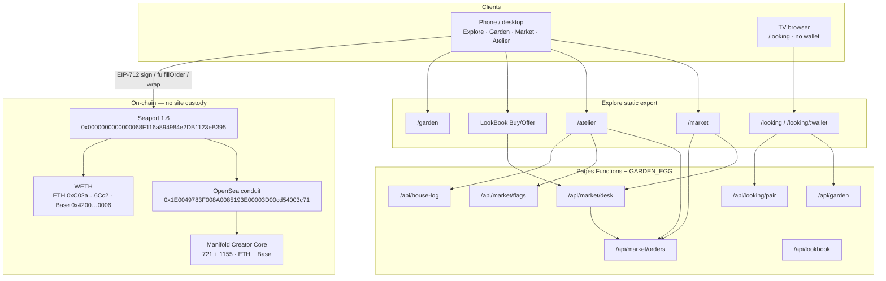
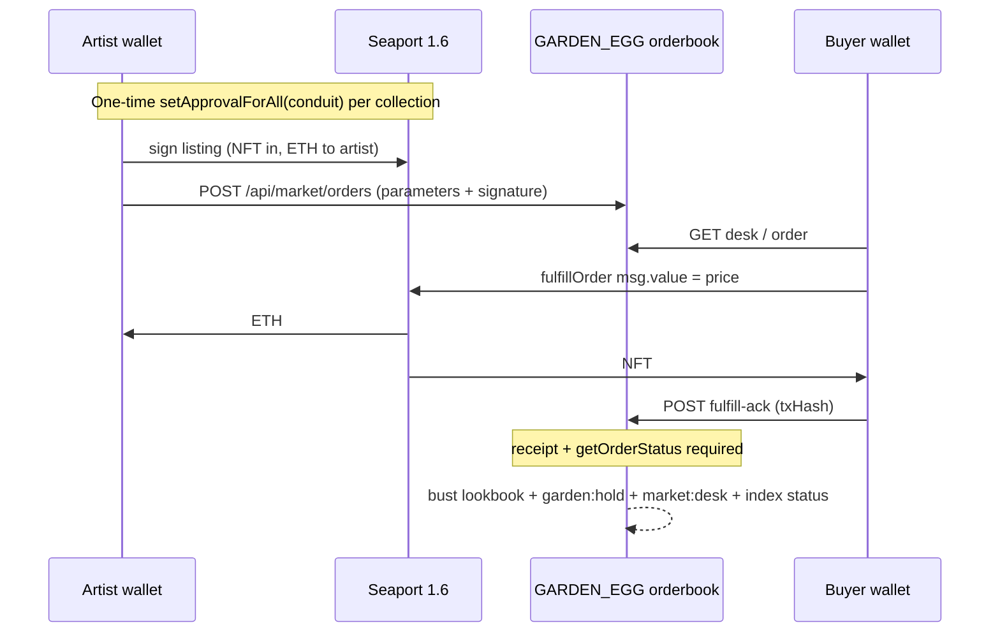
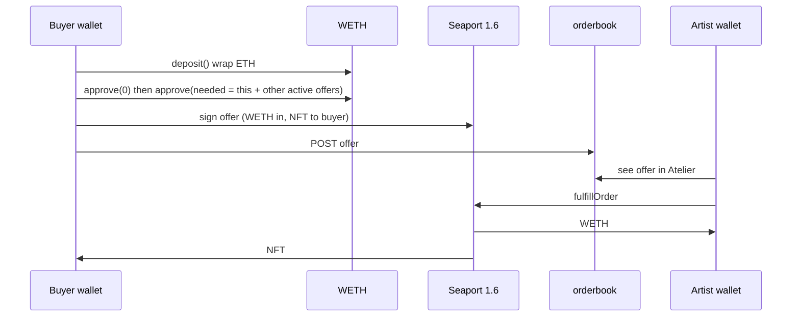
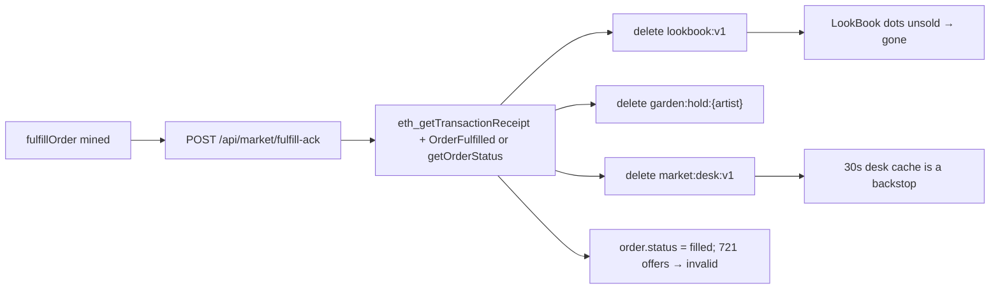

# Explore Studio Desk, House Log, and Looking Room

| Field | Value |
| --- | --- |
| **Document** | Explore Market / House Log / Looking Room Design |
| **Author** | TBD (Nikxname + engineering assistant) |
| **Date** | 16 September 2026 |
| **Status** | Draft (rev 5 — artist product answers locked) |
| **Artist** | Nikxname / [explore.nikxart.xyz](https://explore.nikxart.xyz) / [@nikxname](https://x.com/nikxname) |
| **Scope** | Explore only (`explore/`). House site `nikxart.xyz` is untouched unless a nav/footer link is required. |
| **v1 product** | Studio desk (buy + offer on unsold mint-wallet works) · private versioned House Log · lean TV looking room |

---

## Overview

Explore today is a catalogue, Theatre, Garden, and Atelier. Buying still leaves the house: LookBook Buy/Offer are outbound OpenSea/Raster links (`explore/components/LookBook.tsx` → `marketHref`), and the Market series is a static gateway dump (`explore/lib/market.ts` + `explore/data/market.json`). The collection pipe on the home page even hides Market (`COLLECTION_NAV` filters `s.id !== 'market'`). Collectors cannot complete a studio purchase without leaving `explore.nikxart.xyz`, and the studio pays OpenSea/Raster fees for the privilege.

This design turns Explore into three new rooms, all on the existing Next.js static export + Cloudflare Pages Functions + `GARDEN_EGG` KV stack:

1. **Studio desk** (`/market`) — native Seaport 1.6 listings and offers against tokens held by `ARTIST_MINT_WALLET` (`0x81c306bcdc036f334ef4fb8f85a8e6be730a0763`). ETH only, on the chain the token already lives on. The site never custodies the work. OpenSea/Raster remain a quiet footnote when there is no native ask.
2. **House Log** — private, versioned, append-only studio record inside Atelier, artist-wallet-only. Replaces ad-hoc markdown (`STATE.md`) as the live narrative of Explore evolution. Git remains the source of truth for code.
3. **Looking Room** (`/looking`, `/looking/:wallet`) — a 10-foot, no-wallet viewing surface for Samsung Internet on Samsung Smart TVs, designed so the same URL can later wrap in LG/Fire/Chromecast/Apple TV/console WebViews. Phone Garden stays dense; TV stays sparse.

v1 is **not** a collector-to-collector marketplace. That is a later phase that reuses the same Seaport client and orderbook shape.

---

## Background & Motivation

### Current surfaces

| Surface | Domain | Role | Touch in v1 |
| --- | --- | --- | --- |
| House / live drop | `nikxart.xyz` (`src/`) | Timed fragment mint | **Do not change** |
| Explore | `explore.nikxart.xyz` (`explore/`) | Catalogue, Theatre, Garden, Atelier, Will It | **All new work lives here** |
| Collection hosts | `afamiliarburn.nikxart.xyz`, … | Rewrites onto Explore (`explore/functions/_middleware.ts`) | **Skip `/market` and `/looking`**; links to those rooms are absolute `explore.nikxart.xyz` |

Stack facts that constrain the design:

- Explore is **Next.js pages + `output: 'export'`** (`explore/next.config.js`) deployed to Cloudflare Pages project `nikxart-explore` (`explore/wrangler.jsonc`, `npm run deploy:explore`).
- Dynamic APIs are **Pages Functions** under `explore/functions/api/*` with KV binding `GARDEN_EGG`.
- Wallet connect already exists on Garden as raw `window.ethereum` / `eth_requestAccounts` (`explore/pages/garden.tsx`). Atelier auth is `personal_sign` of message `nikxart atelier` (`ATELIER_MESSAGE` in `explore/lib/collectors.ts`), verified server-side with `viem.verifyMessage`.
- **viem 2.38.0 is already a dependency.** There is **no wagmi** in Explore. House-site `WalletProvider` is Manifold Connect and must not be imported here.
- Six Nikxname contracts in `explore/lib/contracts.ts` / `explore/config/collections.ts`: five Ethereum, one Base (`for-her`, ERC-1155). All are **Manifold Creator Core**. Tokens are not migrated.
- Studio inventory is already computed: `GET /api/garden?wallet=0x81c3…0763` and `GET /api/lookbook` (`lookbook:v1`, 90s TTL). LookBook stock dots: `mine | unsold | listed | offer`.
- Garden looking links already exist: `/garden/0x*` rewrites to `/garden` (`explore/public/_redirects`) and `walletFromPath` hydrates a view-only garden. LookBook and Atelier are hidden on those links (`viewOnly`).
- Observation already has Fit / 100% **buttons** (`explore/components/CanvasLook.tsx`) but only pointer/pinch — **no** `F`/`1`/arrow-pan keyboard map yet. `theatreStillUrl` / `catalogueThumbUrl` / `observeStillUrl` **pass GIFs through unchanged**; Looking Room must not use them as the default still.

### Pain points

- Buying requires leaving the house and paying marketplace fees.
- `market.json` listings are empty (`"listings": []`); the Market tab is hubs, not a desk, and is not even in the home pipe.
- Studio notes live in git markdown (`STATE.md` is a stale Fragment VI snapshot). The artist does not read git history as a studio journal.
- Garden looking links work on a phone; they are not a 10-foot living-room experience (dense beds, hover, tiny pills, no D-pad model).

---

## Goals & Non-Goals

### Goals

1. Buy unsold studio works on-site from `ARTIST_MINT_WALLET` using Seaport, without leaving Explore.
2. Collectors can sign on-site offers; the artist accepts or declines in Atelier.
3. 0% OpenSea fee on native orders (no OS fee recipient, no OS signed zone).
4. Honest safety copy: on-chain settlement, no site custody, buyer pays gas, WETH required for offers.
5. After a sale, Garden/LookBook stock updates (unsold → sold).
6. Atelier kill switch to disable public Buy (and independently Offers) if something looks wrong.
7. Private versioned House Log, artist-wallet-only, KV-backed, not in public nav.
8. Lean Looking Room that works in Samsung Internet on Samsung Smart TVs, with the same URL usable on adjacent living-room browsers.
9. House language: Cormorant, rose-gold, Garden/Atelier tone — not a crypto exchange.

### Non-goals (v1)

- Collector-to-collector listings, trading, or bidding wars (phase 2).
- USDC or any currency other than ETH (and WETH as the Seaport offer vehicle).
- New NFT contract, wrapping, or migrating off Manifold Creator Core.
- Native Tizen / LG store binaries (the looking URL is the foundation those apps would wrap later).
- Changing `nikxart.xyz` drop/mint flow.
- Blur-style order matching, floor charts, rarity tools.
- Custom ETH-escrow marketplace contract.
- Publishing House Log, or showing it on Garden looking links.
- Wallet connect on the TV looking surface.

---

## Key Decisions

1. **Settlement = Seaport 1.6, not a custom escrow.** Seaport already covers studio asks (NFT → native ETH) and buyer offers (WETH → NFT), is deployed and audited, and keeps tokens in the mint wallet until fulfillment. A custom vault would be an unaudited custody surface we explicitly refuse.
2. **Listings are native ETH; offers are WETH.** Vanilla Seaport cannot escrow native ETH on the offerer side without a custom zone. We will not hide this. Copy, Atelier, and Market must say “wrap ETH to WETH to offer.” There is no native-ETH offer path in v1. Cancel/expiry invalidate the **order**; they do **not** revoke the WETH `approve`. ERC-20 `approve` **replaces** allowance (it does not add). v1 sets `approve(conduit, needed)` where `needed` is this offer’s `priceWei` **plus** the sum of this offerer’s other active offers on that chain — or `approve(0)` then `needed`. One allowance covers all open offers. Revoke zeros it; cancel open offers first.
3. **Zero OpenSea fee by construction.** Orders are built on-site with `zone = 0x0`, `orderType = FULL_OPEN`, and a single consideration recipient (the artist). We never attach `OPENSEA_FEE_RECIPIENT`. Using OpenSea’s **conduit** (`0x1E0049783F008A0085193E00003D00cd54003c71`) does not attach fees, but it **does** grant `setApprovalForAll` to OpenSea’s operator — the same trust model as listing on OpenSea. Manifold Creator Cores historically sit behind Operator Filter Registry; the OS conduit is the compatibility default because `NO_CONDUIT` (Seaport as operator) may revert. First self-buy confirms a 0-fee order actually fills. Revoke lives in Atelier.
4. **v1 seller = `ARTIST_MINT_WALLET` only.** SirMavv remains an Atelier admin for the collector book (`isAtelierAdmin`) and may **view** the Desk tab read-only; POSTing listings, cancelling, accepting offers, or flipping flags as SirMavv is 403. Studio inventory is the mint wallet’s holdings, which `/api/garden` and `/api/lookbook` already treat as “unsold.”
5. **House Log is artist-wallet-only** (`isArtistWallet`). The collector book stays shared with SirMavv. Site-evolution notes are the artist’s hand.
6. **Dedicated `/looking` for TV**, rather than teaching Garden 10-foot CSS. Phone Garden stays dense (beds, LookBook, Hang). Looking Room is sparse, remote-first, and can open a garden by wallet or pairing code.
7. **Dedicated `/market` route** (plus a nav link next to Garden), not a revival of the hidden Market series tab. Wallet connect + checkout need a shareable URL; the catalogue pipe stays collections-only.
8. **Thin viem Seaport client, no wagmi, no `seaport-js`.** Explore already signs with `window.ethereum` and verifies with viem. `seaport-js` pulls ethers and would bloat the static bundle (`PROTOCOLS.md` watches chunk size). EIP-712 hashing is the **highest-risk code in the project**: PR 1 is gated on `seaport.getOrderHash` via `eth_call` matching our hash, plus `viem.verifyTypedData` / `recoverTypedDataAddress` against domain `{ name: "Seaport", version: "1.6", chainId, verifyingContract }`. We sign `OrderComponents` (parameters **plus** `counter`), not `OrderParameters` alone. v1 fulfill path is `fulfillOrder`; `fulfillBasicOrder` is a later gas optimization.
9. **Ethereum ERC-721 ships first; Ethereum 1155 (`For You..`) next; Base (`For Her..`) last.** Dual-chain **and** 1155 `balanceOf` both double testing. There is no Sepolia copy of these Manifold tokens, so the first self-buy is a 721 on Ethereum. `for-you` qty UI is still v1, not dropped — it is not on the first fulfill path.
10. **Orders live in `GARDEN_EGG`, not OpenSea’s order API.** Posting through OpenSea’s API is how their 2.5% comes back. The site is the orderbook for native desk orders. Storage is `market:order:{hash}` + `market:index:v1` from day one (not a single last-write-wins blob).
11. **Kill switch is a KV flag, not a deploy.** `atelier:market:flags:v1` hides Buy/Offer **on this site**. Signed `FULL_OPEN` listings remain fulfillable on-chain until the artist `cancel`s them. Public copy must say so. Both flags **default false** until the artist PUTs them on. Flag PUT is bound to `updatedAt` (compare-and-swap) so a leaked atelier query-string signature cannot silently flip the switch without a current book.
12. **Git remains source of truth for code; House Log is the human narrative.** Do not delete markdown history. Do not put secrets in the log.

---

## Proposed Design

### Architecture



### Settlement (Seaport 1.6)

Canonical cross-chain addresses (same on Ethereum and Base):

| Piece | Address | Role in v1 |
| --- | --- | --- |
| Seaport 1.6 | `0x0000000000000068F116a894984e2DB1123eB395` | Settlement |
| ConduitController | `0x00000000F9490004C11Cef243f5400493c00Ad63` | Already deployed; we do not deploy a conduit |
| OpenSea conduit | `0x1E0049783F008A0085193E00003D00cd54003c71` | Token operator after `setApprovalForAll` |
| OpenSea conduit key | `0x0000007b02230091a7ed01230072f7006a004d60a8d4e71d599b8104250f0000` | `conduitKey` on orders |
| Zone | `0x0000000000000000000000000000000000000000` | **No zone.** Avoids OpenSea signed-zone fee logic |
| Order type | `FULL_OPEN` (`0`) | Anyone may fulfill |
| WETH Ethereum | `0xC02aaA39b223FE8D0A0e5C4F27eAD9083C756Cc2` | Bid currency — Seaport **offer** item (`itemType = 1`), not consideration |
| WETH Base | `0x4200000000000000000000000000000000000006` | Same, Base (slice **F** / PR 9) |

**Open question remainder:** OpenSea’s current fee-recipient and signed-zone addresses change. We do not need them, because we never attach them. If a future Seaport upgrade requires a non-zero zone for `FULL_OPEN` (unlikely), stop public Buy via the kill switch rather than guessing.

#### Seaport 1.6 `getOrderStatus` (do not invent fields)

```solidity
function getOrderStatus(bytes32 orderHash) external view returns (
    bool isValidated,
    bool isCancelled,
    uint256 totalFilled,
    uint256 totalSize
);
```

There is **no** `totalCancelled`. A never-seen order returns `(false, false, 0, 0)` — `isValidated == false` is normal.

| On-chain action | `isCancelled` | `totalFilled` | `getCounter(offerer)` |
| --- | --- | --- | --- |
| `cancel([components])` for that hash | `true` | unchanged | unchanged |
| `incrementCounter()` (“Cancel all”) | stays `false` on old hashes | unchanged | **increments** — old `parameters.counter` no longer matches |
| Successful `fulfillOrder` | `false` | `> 0` | unchanged |

`OrderCancelled(bytes32 orderHash, address indexed offerer, address indexed zone)` — **`orderHash` is not indexed**. Parse log **data**, not topics, if matching a receipt. `CounterIncremented(uint256 newCounter, address indexed offerer)` is the bulk-cancel log.

**Buy / accept preflight (required):**

```
status = getOrderStatus(orderHash)
reject if status.isCancelled
reject if status.totalFilled > 0
reject if getCounter(offerer) !== parameters.counter
```

`isValidated` may be true or false; ignore it for v1.

#### Listing (studio ask) — native ETH

Artist wallet signs **`OrderComponents`** (Seaport `OrderParameters` **plus** `counter`):

- **Offer:** length **exactly 1**. ERC-721 (`itemType = 2`) or ERC-1155 (`itemType = 3`) of `tokenId`, `startAmount = endAmount = qty` (721 qty is always 1).
- **Consideration:** length **exactly 1**. Native ETH (`itemType = 0`), `recipient = ARTIST_MINT_WALLET`, `startAmount = endAmount = priceWei`. `totalOriginalConsiderationItems` **must equal** `consideration.length` (1).
- **No other recipients.** This is the 0% fee. Server rejects `priceWei === 0` (a 0-wei listing is a free transfer).
- `offerer = ARTIST_MINT_WALLET`, `counter = seaport.getCounter(offerer)` at sign time.
- `startTime = floor(Date.now()/1000) - 60` so a clock ahead of the block does not revert `fulfillOrder`. `endTime = startTime + duration` (default 30 days, Atelier-editable).
- EIP-712 `chainId` is `1` or `8453` to match the token’s chain — never mixed with `verifyingContract`.
- `conduitKey = OPENSEA_CONDUIT_KEY` so an existing OpenSea approval can be reused; if `isApprovedForAll(artist, conduit) === false`, Atelier prompts `setApprovalForAll(conduit, true)` once per collection.
- Tokens **never** leave the mint wallet until a buyer calls `fulfillOrder`.
- **Replace price** = on-chain `cancel` of the old order + sign a new one. Do not mutate a stored signature.

Buyer on `/market` or LookBook:

1. Reads the stored **listing** (`parameters + signature` are public for listings because `FULL_OPEN` fulfillment needs them).
2. Client **and** buy-sheet server preflight (all required in v1):
   - `publicBuyEnabled`
   - `getOrderStatus(orderHash)`: `!isCancelled && totalFilled == 0` (`isValidated` ignored)
   - `getCounter(offerer) === parameters.counter` (catches `incrementCounter` / Cancel all, which does **not** set `isCancelled`)
   - block time inside `[startTime, endTime]`
   - chain matches; wallet switched (`wallet_switchEthereumChain`, with `wallet_addEthereumChain` fallback for Base)
   - ETH balance ≥ price + gas
   - **721:** `ownerOf(tokenId) === ARTIST_MINT_WALLET` via RPC `eth_call` (do **not** use `fetchTokenOwner` as the source of truth)
   - **1155:** `balanceOf(ARTIST_MINT_WALLET, tokenId) >= listQty` via RPC `eth_call` (Alchemy `getOwnersForToken` returns an arbitrary first owner when there are many; `explore/lib/owner.ts` is Theatre metadata, not market preflight)
3. Sends **`fulfillOrder`** with `msg.value = priceWei`. (`fulfillBasicOrder` / `BasicOrderType` mapping is an optimization after a 721 ETH listing is proven; not v1 default.)
4. Pays **gas + listing price in native ETH**. No WETH wrap for buys.
5. NFT moves artist → buyer; ETH moves buyer → artist in the same transaction.
6. Client POSTs `/api/market/fulfill-ack` with the tx hash. The function **does not trust the client**: it checks the receipt and `getOrderStatus` before marking filled.

Copy on the buy sheet:

> The sale settles on-chain through Seaport. This site does not hold the work or your ETH. You pay network gas. There is no OpenSea fee on this desk.

Kill-switch line (visible when flags are off **and** as a footnote when on):

> Turning off Public Buy hides the button on this site. A listing already signed still settles on-chain until the artist Cancels it.

Never ask the user to send ETH to a raw address as the primary path. A “copy artist address” control is allowed only as a collapsed footnote, not a buy button.

#### Offer (collector bid) — WETH

The **only legal v1 offer** (server rejects anything else):

| Side | Length | Shape |
| --- | --- | --- |
| `offer` | **exactly 1** | ERC-20 (`itemType = 1`), `token` = chain WETH, `identifierOrCriteria = 0`, `startAmount = endAmount = priceWei` |
| `consideration` | **exactly 1** | NFT `itemType` 2 (721) or 3 (1155), Nikxname contract, `recipient === parameters.offerer` (the buyer) |

`zone = 0x0`, `orderType = FULL_OPEN`, `conduitKey = OPENSEA_CONDUIT_KEY`, `totalOriginalConsiderationItems = 1`. Extra consideration (another token, ERC-20, ETH) would be pulled from the **mint wallet** on Accept — that is why the invariant is as strict as listings.

Wrap path is a **first-class Market step**, not a footnote:

1. Show WETH balance. If short, **Wrap** calls WETH `deposit()` for the shortfall (or the full `priceWei` if they want a clean wrap).
2. **Approve is a replace, not an add.** ERC-20 `approve(spender, amount)` sets the spender’s allowance to `amount`; it does **not** increment. Caps allow one active offer per offerer **per token**, but the same collector may have live offers on **different** works. Before signing offer N on a chain:

   ```
   others = sum(priceWei of this offerer’s other active offers on this chain)  // from market:index
   needed = priceWei + others
   ```

   If `allowance(offerer, conduit) !== needed`: `approve(conduit, 0)` then `approve(conduit, needed)` (two txs). WETH allows non-zero→non-zero in one call; v1 still documents 0-then-set so we never describe a “top-up” that does not exist. **Do not** call `approve(conduit, priceWei)` as the only step when other offers are live — that would **shrink** the allowance and make earlier offers unfillable, or **replace** it with a larger number and leave extra allowance. **Do not** use `MaxUint256`.
3. Buyer signs `OrderComponents` (WETH is the **offer** item, NFT is consideration to the buyer). `startTime = now - 60`, default `endTime = + 7 days`.
4. WETH **stays in the buyer’s wallet**. Seaport/conduit can `transferFrom` up to the **current allowance**. One allowance covers **all** open offers on that chain. After a fill, `transferFrom` decreases allowance by that offer’s `priceWei`; remaining offers still need `allowance >=` their prices.
5. **Cancel does not revoke `approve`.** Copy must say this. Market exposes **Cancel order** and **Revoke WETH approval** (`approve(conduit, 0)`) as two controls. Copy: “Revoke zeros the conduit’s WETH allowance. Cancel open offers first, or Accept will revert.” A leftover allowance plus a leftover **signed** offer is still spendable until cancel/expiry — revoke without cancel also makes Accept revert (`allowance >= priceWei` fails), which is safe but confusing; lead with Cancel then Revoke.
6. Artist sees a **decoded preview** in Atelier (same seriousness as listing signatures): “Seaport offer · {title} · {price} WETH · {chain} · NFT to {offerer} · no other consideration.” Full `parameters + signature` are **not** on the public GET; they require an artist atelier signature. Accept = `fulfillOrder` after preflight (`!getOrderStatus.isCancelled && totalFilled == 0`, `getCounter` match, WETH `balanceOf(offerer) >= priceWei`, WETH `allowance(offerer, conduit) >= priceWei`, studio `ownerOf`/`balanceOf`).
7. If the artist never accepts, the buyer cancels **or** waits for `endTime` so the order cannot be filled — then Revoke if they want the allowance gone. After cancelling one of several offers, they may re-`approve(needed')` for the remaining sum (optional; leftover allowance is only extra, not a drain beyond signed orders).

There is no native-ETH offer in v1. Building one would mean a custom zone or escrow — the thing we are not doing.

Caps: **one active offer per offerer per `contract+tokenId`**. Max **8** active public offers per token (server 400 beyond that). Replacement of the same token = cancel-ack the old offer, then POST a new one (and re-approve `needed` for remaining+new). Sequential alternative if we ever tighten UX: one active offer per offerer per chain — then `needed = priceWei`. v1 does **not** take that restriction; it uses the sum.





#### ERC-721 vs ERC-1155

| Series | Standard | Chain | v1 slice |
| --- | --- | --- | --- |
| `a-familiar-burn` | 721 | Ethereum | **A — first fulfill** |
| `the-void` | 721 | Ethereum | A |
| `life-impressions` | 721 | Ethereum | A |
| `one-of-ones` | 721 | Ethereum | A |
| `for-you` | 1155 | Ethereum | **C / PR 8 — after 721 buy + WETH offers** |
| `for-her` | 1155 | Base | **F / PR 9 — after Ethereum 1155** |

1155 rules (slice **C** For You, then slice **F** For Her):

- Do **not** reuse `fetchTokenOwner` (`explore/lib/owner.ts`). For 1155 it calls Alchemy `getOwnersForToken` and, if multiple owners, returns **the first**; if Alchemy fails it returns `null`. Market preflight is `balanceOf(ARTIST_MINT_WALLET, tokenId) >= qty` via `eth_call` (same RPC pattern as the 721 `ownerOf` fallback in `owner.ts`, selector `0x00fdd58e`).
- List/offer `startAmount`/`endAmount` = units (usually 1). Cap `qty` to garden bed `quantity`. Atelier shows “list 1 of N held.”
- **Concurrent listings of the same 1155 id:** **not allowed** in v1. One active native listing per `contract+tokenId`. To change price, cancel + re-sign. Remaining studio quantity after a partial sale can be listed again as a new order.
- After selling units, remaining `quantity > 0` stays unsold. LookBook `unsold` if studio `quantity > 0`.
- Catalogue grouping (`collapseByEdition` in `explore/lib/chainWorks.ts`) must **not** be used as the listing key. Orders key on `contract + tokenId + chain`, matching garden beds (`${seriesId}-${tokenId}`).
- On fulfill-ack of a **721**, mark all active **offers** for that token `invalid`. On **1155**, only if remaining studio `quantity` is 0.

#### Seller allowlist

```ts
function canList(address: string | null): boolean {
  return isArtistWallet(address); // ARTIST_MINT_WALLET only
}
```

SirMavv (`0xcc3b…42c7`) can open Atelier, pull collectors, and **view** the Desk tab read-only. POSTing a listing, cancelling, accepting, or PUTting flags as SirMavv is 403. Phase 2 relaxes `canList` to any holder.

### Market UX

#### Route and nav

- New page `explore/pages/market.tsx` → `https://explore.nikxart.xyz/market`.
- Nav: add a `Market` link beside Garden on Explore home, Garden, collection sites, and Will It. Do **not** put Market back in `COLLECTION_NAV` (that pipe is collections).
- Collection-host Market (and Looking) links must be **absolute** `https://explore.nikxart.xyz/market` (and `/looking`), matching `CollectionSite.tsx` Garden (`https://explore.nikxart.xyz/garden`). Relative `/market` on `afamiliarburn.nikxart.xyz` would be rewritten onto `/a-familiar-burn/market` unless skipped.
- `robots`: indexable. Title: `Desk · Nikxname`.
- `explore/functions/_middleware.ts` skip list today is `/_next`, `/api/`, `/garden`, `/atelier`, and dotted files. **Must also skip `/market` and `/looking`.**

The old `getMarketWorks()` hubs remain as a **footnote component** (`MarketElsewhere`) rendered under the desk when a work has no native ask. `explore/data/market.json` is no longer the primary inventory.

#### Desk layout (house language)

Quiet, not an exchange. Reuse Explore type (`Cormorant Garamond`, `--rose-gold`, `--cream`, `--wall`). No sparkline, no “floor,” no cart.

Sections, in order:

1. **Kicker + lead** — “Studio desk. Works still held by the artist, priced on-chain.”
2. **Filter chips** — collection, plus All. Slice **A** (and **B**, same Ethereum 721 set) shows Ethereum 721 series only; `for-you` appears when slice **C** / PR 8 ships; `for-her` when slice **F** / PR 9 ships (`chainReady` + `standardsReady` + series gate).
3. **Work rows** — still thumb (`catalogueThumbUrl`, GIF-safe: Looking Room has a stricter still helper; Market may keep GIF thumbs small). Title, collection, price or “Open to offers,” primary action, chain pill (`Ethereum` / later `Base`).
4. **Buy / Offer sheet** — overlay, not a new site. Wallet connect (same `eth_requestAccounts` pattern as Garden). Receipt of last tx as a line of house copy, with an explorer link.
5. **Elsewhere** — “Also listed on OpenSea / Raster” only when `listedHref` exists **and** there is no native ask. Native-first.

Stock language (align with LookBook, `STOCK_LABEL`):

| State | Dot | Primary action |
| --- | --- | --- |
| Studio held, native ask | Listed | **Buy** (fulfill) |
| Studio held, no ask | Unsold | **Offer** |
| Studio held, native ask + offers | Listed | **Buy**; Offer secondary |
| Not studio, not yours | Offers | Offer (phase 2 will also allow collector asks; v1 still offer-only if somehow shown — v1 desk **filters to studio holdings**) |
| Yours | Yours | Look / Hang (no buy) |

v1 desk inventory = intersection of `/api/garden?wallet=ARTIST_MINT_WALLET` and catalogue works. Sold tokens drop off the desk when the garden pulse changes.

#### LookBook

Keep Hang / Look. Native **Buy** ships with the public desk (PR 4), not after offers:

- If a native listing exists for that work key → in-page Buy (same `BuySheet` as `/market`, or `/market?work=<id>`). Payload field `nativeListed`.
- Else if studio-held → Offer sheet once PR 5 lands; until then the verb stays a quiet “elsewhere” or “Offer coming.”
- Else keep outbound OpenSea/Raster as a quiet “elsewhere” link, not the primary verb.

LookBook is Garden-only today (`inGarden && !viewOnly`). Do not show Buy on TV looking links.

#### Atelier desk panel

New Atelier tab beside Collectors / Assets (`explore/pages/atelier.tsx` `panel` state):

**Desk**

- Studio holdings table (from `/api/garden` + orders).
- Per row: set price (ETH, `> 0`), duration, **Post listing** (EIP-712 Seaport `OrderComponents`), **Cancel listing** (on-chain `cancel` then cancel-ack). Incoming offers with **Accept** / **Decline**. Decline does not spend the buyer’s WETH; Accept = `fulfillOrder` after decoded preview. SirMavv: read-only.
- Order status: `active | filled | cancelled | expired | invalid` (invalid = studio no longer holds **or** 721 sold while leftover offers remain; shown in rose; listing auto-hidden from public desk).
- **Public Buy** / **Public Offers** toggles (kill switches). Copy: hiding Buy does not un-sign `FULL_OPEN` orders — **Cancel** is the real stop. PUT sends `updatedAt` from the last GET; 409 if stale.
- Approval status per collection (`isApprovedForAll(conduit)`). Advanced: **Revoke conduit**. First self-buy is the Operator Filter rehearsal.
- Ethereum 721 collections in the first Desk ship; `for-you` / Base rows appear with their slices.

Copy in Atelier when posting a listing: the wallet will show a Seaport signature, not `nikxart atelier`. The UI must preview “Seaport listing · {title} · {price} ETH · {chain}” before `eth_signTypedData_v4`. Offer Accept previews the decoded single WETH → single NFT order and refuses if the stored parameters fail the legal-offer invariant.

#### Wallet helper (Explore, not House)

New `explore/lib/wallet.ts` — no wagmi:

```ts
type Eth = {
  request: (args: { method: string; params?: unknown[] }) => Promise<unknown>;
};

export async function connectWallet(): Promise<`0x${string}`> { /* eth_requestAccounts */ }
export async function ensureChain(chain: 'ethereum' | 'base'): Promise<void> {
  /* wallet_switchEthereumChain 0x1 / 0x2105; on 4902 call wallet_addEthereumChain then switch */
}
export async function signTypedData(params: unknown): Promise<`0x${string}`> { /* eth_signTypedData_v4 */ }
export async function sendTx(tx: unknown): Promise<`0x${string}`> { /* eth_sendTransaction */ }
```

Reuse Atelier’s hex `personal_sign` helper by extracting `signAtelier()` from `explore/pages/atelier.tsx` into `explore/lib/atelierAuth.ts` so Market flags and House Log share one path.

Chain mismatch: if the token is Ethereum and the wallet is on Base, block the button and ask to switch. Never submit a Seaport order with the wrong `chainId` in the EIP-712 domain.

### House Log (private Atelier)

#### Auth

- Same `ATELIER_MESSAGE` + `verifyMessage` as `explore/functions/api/atelier.ts`.
- **Write and read restricted to `isArtistWallet`.** SirMavv receives 401 with `{ error: 'artist_only' }`. Collector book endpoints stay `isAtelierAdmin`.
- `noindex` already on Atelier. House Log is not linked from Explore nav, Garden, or looking URLs.

#### Storage

KV key `atelier:house-log:v1` on `GARDEN_EGG`:

```ts
type HouseLogSurface =
  | 'explore'
  | 'garden'
  | 'theatre'
  | 'market'
  | 'looking'
  | 'house'
  | 'atelier'
  | 'will-it';

type HouseLogEntry = {
  id: string;               // crypto-random 16 hex
  createdAt: string;        // ISO
  versionId: string;        // explore-YYYYMMDD-letter, e.g. explore-20260916-a
  title: string;            // ≤ 120
  body: string;             // ≤ 20_000, plaintext
  surfaces: HouseLogSurface[];
  deployId?: string;        // Cloudflare Pages deployment id, optional
  gitSha?: string;          // 7–40 hex, optional
  author: `0x${string}`;    // must be ARTIST_MINT_WALLET
  supersedes?: string;      // previous entry id if this is a revision
};

type HouseLogBook = {
  version: 1;
  updatedAt: string;
  entries: HouseLogEntry[]; // append-only, newest last
};
```

**Version id style:** `explore-YYYYMMDD-letter`, echoing House `SITE_ASSET_VERSION` (`src/config/artist.ts`, e.g. `20260813bannerlast`) without colliding with drop-site asset bumps. Letter increments when multiple notes share a day (`a`, `b`, …). The UI suggests today’s stamp; the artist may edit.

Immutability: PUT never edits an existing `id`. A “Revise” action copies title/body into a new entry with `supersedes`. The GET view groups by `versionId` and shows the chain.

Secret guard on write runs **only on `title` + `body`**, never on `gitSha` / `deployId` (those are hex by design). Reject if:

- PEM / key armor: `BEGIN (OPENSSH|PRIVATE|RSA|EC) KEY`
- Cloudflare / Wrangler **token assignment**, not the word “wrangler”: `(?i)(CLOUDFLARE_API(_TOKEN)?|CF_API_TOKEN)\s*[=:]\s*\S+` or `(?i)wrangler\s+(login|config)|api[_-]?token\s*[=:]\s*\S+`
- Hex that looks like a **private key in context**: `(?i)(private key|secret key|api token).{0,40}0x[a-f0-9]{64}`

Do **not** reject bare `0x` + 64 hex — that is a transaction hash the artist will paste after a self-buy (and explorer URLs). Tell the artist “that looks like a secret — it was not saved.”

Trackable across deploys because KV is independent of Pages deployments. Optional `gitSha` / `deployId` fields are how a note points at a ship.

#### API

`explore/functions/api/house-log.ts`

| Method | Auth | Behavior |
| --- | --- | --- |
| `GET` | artist signature in **`X-Atelier-Address` / `X-Atelier-Signature` headers** (prefer headers over query so referrers do not leak) | Full book. **Missing KV key** → `{ ok: true, version: 1, updatedAt: '', entries: [] }` (same shape as an empty book, not 404) |
| `POST` | artist signature in JSON + `updatedAt` from last GET (409 on mismatch) | Append one entry; return `{ ok, entry, updatedAt }`. **First append accepts `updatedAt: ''`.** After write, `updatedAt` is the new ISO timestamp. |
| `OPTIONS` | — | CORS |

No public GET. Do not add a Pages Function that strips notes the way `/api/collectors` strips collector notes — the log simply is not public.

#### UI

Atelier tab **Log**. Professional: date, version id, title, surfaces as quiet marks, body in a readable serif column, related deploy/SHA as monospace. New entry form at the top. No markdown renderer that can XSS (plaintext + preserved newlines only).

### Looking Room (TV / living room)

#### Why a new route

Garden `/garden/:wallet` is already a looking link, but the page is a dense sanctuary: beds, butterfly egg, LookBook, Hang, ArrangeWall, hover states, 58px nav. Teaching that layout 10-foot CSS would fight the phone experience.

**Decision:** `explore/pages/looking.tsx` is TV-first. It loads the same garden payload (`/api/garden?wallet=`). Phone Garden does not change. **Do not reuse `observeStillUrl` / `theatreStillUrl` / `catalogueThumbUrl` as the TV default** — those helpers **return GIFs unchanged**, and `observeStillUrl` prefers `mediaUrlHi` then `mediaUrl`, so a GIF master would play. `CanvasLook` is an `` with pointer/pinch only (`explore/components/CanvasLook.tsx`); it cannot host `<video>`.

#### Routes

| URL | Behavior |
| --- | --- |
| `/looking` | Idle room: “Open a garden” — pairing code field, or wait. No wallet. |
| `/looking/0x{40}` | View that wallet’s holdings. Rewrite `/looking/0x* → /looking` 200, same pattern as `explore/public/_redirects` garden rule. |
| `/looking?code=AB34` | Resolve short code via `/api/looking/pair`, then client-navigate to `/looking/0x…`. |

`_middleware.ts` must skip `/looking` on collection hosts.

#### Pairing

Phone Garden already has “Your looking link” (`gardenShareUrl`). Add a second line: **Open on TV** → QR of `https://explore.nikxart.xyz/looking/{wallet}` plus a 4-character code.

**Code alphabet (32 glyphs, no lookalikes):** `23456789ABCDEFGHJKMNPQRSTUVWXYZ` — Crockford without `0`, `O`, `I`, `L`, `1`. Not full Crockford (which includes `0`). Generate with `crypto.getRandomValues`. 32⁴ ≈ 1M codes; TTL 10 minutes.

QR: **no QR library in `package.json`.** v1 renders a tiny inline SVG via a ~40-line `explore/lib/qrSvg.ts` (Reed–Solomon QR for a URL this short) **or** an `` to `https://explore.nikxart.xyz/looking/{wallet}` with a visible URL the artist can type. Do not add `qrcode.react` / `qrcode` unless the SVG helper fails review. Prefer SVG so the TV/phone does not call a third-party QR CDN.

KV `looking:pair:<code>` → `{ wallet, exp }` with `expirationTtl: 600`.

`POST /api/looking/pair { wallet }`:

- Unauthenticated, but **rate-limited in the function** (not “Cloudflare will do it” — there is no WAF rule in-repo): max 5 POST/min per CF-Connecting-IP, max 3 live codes per wallet. 429 otherwise.
- Wallet must be `0x`+40 hex. Holdings check uses **cached** `garden:hold:{wallet}` only (do not stampede Alchemy). If cache miss, one garden fetch then refuse further POSTs for that wallet for 30s.
- `GET /api/looking/pair?code=` rate-limit 30/min per IP. Returns `{ wallet }` or 404.

TV: type the code with D-pad (on-screen keypad of the 32 glyphs) or open the QR where the TV browser can.

#### 10-foot UI rules

- Dark room default (`--wall` / `--bg`). No light-theme toggle on TV (keep the control off-screen or behind a long-press).
- Type: title ≥ 48px, body ≥ 24px, focus ring 4px `--rose-gold`. Hit targets ≥ 64px.
- **No hover-only UI.** `:focus-visible` is the remote.
- D-pad: Arrow keys move a spatial index (works grid → stage → Fit/100%/Back). Enter selects. Escape / Back closes stage.
- Limited motion: honour `prefers-reduced-motion`; no feature-banner rotator; no `PixelCascadeSweep`.
- **Default still (TV):** a new helper `lookingStillUrl(work)` → first non-GIF among `coverUrl` (if not `.gif`), Raster-style `700.avif` when we have a preview hash, then `preferStill()` skipping `.gif`. **Never** default to `*.gif`. Grid thumbs are stills only.
- **Play motion** is an explicit action after Enter on the focused work:
  - If `mediaTiersFor` has a video tier: `<video>` at **1080p** (`defaultTierId` 1080 then 2k). **Do not route video through `CanvasLook`.** New `LookingStage` with `<video playsinline muted loop>` started on user-gesture (Samsung autoplay is muted-only and flaky).
  - If the work is GIF-only: play the GIF in an `` inside `LookingStage`, not as the grid default.
- **Observation (stills):** `CanvasLook` today has no `F` / `1` / arrow pan — pointer and pinch only. **PR 7 (Looking Room)** adds keyboard handlers (or a `LookingCanvas` wrapper) as specified work, not a passing remark: `F` Fit, `1` 100%, arrows pan when zoomed, Escape close. No pinch required on TV. Keep these handlers **out of PR 8** (For You 1155).
- QA: **a real Samsung TV / Tizen Samsung Internet**, not Chrome device-mode only.
- No LookBook, no Hang, no Buy, no Atelier, no wallet modal.

#### Platform matrix (one URL)

| Platform | How v1 is used | Notes |
| --- | --- | --- |
| **Samsung Smart TV / Tizen** | Samsung Internet, primary QA | Chromium. Autoplay muted. **No MetaMask.** Looking only. |
| LG webOS browser | Same URL | D-pad; verify 1080p mp4 |
| Amazon Fire TV Silk | Same URL | Silk is Chromium; D-pad |
| Chromecast / Google TV | Chrome **tab cast** from phone, or open the looking URL in Google TV Chrome | Not a Cast Connect custom receiver; no Cast SDK in v1 |
| Apple TV | **AirPlay now, native wrap later.** No general web browser on tvOS. AirPlay from iPhone Safari; later a tvOS WebView of this same URL | Artist-locked. Do not design as if Safari-on-tvOS exists |
| PlayStation browser | Same URL | WebKit; D-pad |
| Xbox Edge | Same URL | Closest to desktop Edge |

Native Tizen/LG store apps are out of v1. When they happen, they WebView `https://explore.nikxart.xyz/looking`.

#### Samsung Internet known limits (document in UI, once)

A single quiet line on `/looking`: “This room is for looking. Buying and hanging happen on a phone or computer.” Do not imply a TV wallet will appear.

### Data flow after a sale



`explore/functions/api/garden.ts` already states: “A listing is not a transfer — listed works stay in the garden until they sell.” Native listings must preserve that: stock dot may be `listed` while still `unsold` from a holdings perspective. Only a mined transfer moves the token out of `studioIds`.

**Do not cite Garden’s 20s poll as the desk safety net.** That interval (`explore/pages/garden.tsx` `setInterval(..., 20_000)`) runs only when `!viewOnly && wallet` — it refreshes the **connected collector’s garden**, not the public desk. Desk freshness is: fulfill-ack (receipt-checked) + 30s `market:desk:v1` + 90s `lookbook:v1`. If the client never acks, the next **buy preflight** (`getOrderStatus`) hides a filled listing even if KV still says `active`.

On a successful 721 fill, leftover offers for that token become `invalid`. On 1155, only if remaining studio quantity is 0.

### Feature flags

KV `atelier:market:flags:v1`:

```ts
type MarketFlags = {
  version: 1;
  publicBuyEnabled: boolean;    // code default: false until Atelier PUT
  publicOfferEnabled: boolean;  // code default: false until Atelier PUT
  note: string;                 // shown on /market when disabled
  updatedAt: string;            // CAS token for PUT
};
```

**Code defaults are both `false`.** Missing KV key → both false. The artist flips them in Atelier after a self-buy. GET is public (so the desk can hide Buy). PUT is artist-wallet-only, body includes `updatedAt` from the last GET; mismatch → 409. Prefer `X-Atelier-*` headers over query signatures.

Public copy when disabled: “Buying is paused on this site. Signed listings still settle on-chain until Cancel.” Artist Cancel is the real stop.

---

## API / Interface Changes

### Public desk

`GET /api/market/desk`

Unauthenticated. Cache `Cache-Control: public, max-age=15` plus KV `market:desk:v1` TTL 30s (busted on order write, cancel-ack, and receipt-checked fulfill-ack).

**Holdings source:** union of `/api/garden` beds for the mint wallet (or the existing `garden:hold:{artist}` cache) with stored orders. A token missing from garden beds is `invalid` / omitted from Buy. **Do not `ownerOf`/`balanceOf` every studio token on desk GET** — that walk already happened in garden, and the Alchemy demo key used by `will-it.ts` / `owner.ts` will 429. RPC ownership checks run on **POST list**, **buy preflight**, and **accept preflight** only.

```ts
type DeskWork = {
  id: string;              // seriesId-tokenId
  seriesId: string;
  title: string;
  contract: `0x${string}`;
  tokenId: string;
  chain: 'ethereum' | 'base';
  standard: 'erc721' | 'erc1155';
  quantityStudio: number;
  coverUrl?: string;
  listing: null | {
    orderHash: `0x${string}`;
    priceWei: string;
    priceEth: string;
    endTime: number;
  };
  offerCount: number;
  bestOfferWei?: string;
  elsewhere?: { label: 'OpenSea' | 'Raster'; href: string };
};

type DeskResponse = {
  ok: true;
  flags: { publicBuyEnabled: boolean; publicOfferEnabled: boolean; note: string };
  works: DeskWork[];
  chainReady: ('ethereum' | 'base')[];  // slices A–E: ['ethereum']; Base added in slice F / PR 9
  standardsReady: ('erc721' | 'erc1155')[]; // slices A–B: ['erc721']; 1155 added in slice C / PR 8
};
```

### Orders

Pages Functions live under `explore/functions/api/market/` (Cloudflare maps folders to paths):

| File | Routes |
| --- | --- |
| `desk.ts` | `GET /api/market/desk` |
| `orders.ts` | `GET` + `POST /api/market/orders` and `POST /api/market/orders/cancel-ack` (action via `?action=cancel-ack` **or** sibling `cancel-ack.ts` at `explore/functions/api/market/orders/cancel-ack.ts` — pick one in PR 2 and keep it) |
| `flags.ts` | `GET` + `PUT /api/market/flags` |
| `fulfill-ack.ts` | `POST /api/market/fulfill-ack` |
| `explore/functions/lib/marketStore.ts` | per-hash KV + index + cache bust |

`GET /api/market/orders?work={id}` — public. Returns:

- Active **listing**: full `parameters + signature` (needed for `FULL_OPEN` fulfill).
- Active **offers**: summaries only `{ orderHash, priceWei, endTime, offererShort }`. **No** offer `parameters` or `signature` on this GET.

`GET /api/market/orders?work={id}&full=offers` — artist only (`X-Atelier-*` + `isArtistWallet`). Returns full offer `parameters + signature` for Accept.

`POST /api/market/orders` — body:

```ts
{
  address: `0x${string}`;
  signatureAtelier?: string;     // listings: artist atelier sig, in addition to Seaport sig already inside order
  kind: 'listing' | 'offer';
  chain: 'ethereum' | 'base';
  parameters: OrderComponents;   // includes counter
  signature: `0x${string}`;      // Seaport EIP-712
}
```

Listings: `address` must be `ARTIST_MINT_WALLET` and `signatureAtelier` must verify. Offers: `address` must equal `parameters.offerer`; no atelier message (the Seaport signature *is* the auth). Server:

1. Computes `orderHash` with the same EIP-712 types as Seaport 1.6 (must match `getOrderHash` on-chain).
2. `recoverTypedDataAddress({ domain: { name: "Seaport", version: "1.6", chainId, verifyingContract: SEAPORT_1_6 }, types: EIP_712_ORDER_TYPE, primaryType: "OrderComponents", message: parameters, signature })` must equal `parameters.offerer`. Do not hand-roll ecrecover.
3. Checks:
   - `chainId` 1 or 8453 matching `chain`; `verifyingContract` = Seaport 1.6
   - `zone === 0x0`, `orderType === 0`
   - **Listing invariant:** `offer.length === 1` (NFT 2 or 3), `consideration.length === 1` (native ETH `itemType = 0`, `recipient === ARTIST_MINT_WALLET`), `priceWei > 0`, `totalOriginalConsiderationItems === 1`
   - **Offer invariant:** `offer.length === 1` (WETH `itemType = 1`, token = chain WETH, `identifierOrCriteria = 0`), `consideration.length === 1` (NFT 2 or 3, Nikxname contract, `recipient === parameters.offerer`)
   - token is a Nikxname contract (`findNikxContract`); chain matches `NIKX_CONTRACTS[].chain`; standard matches slice (`standardsReady`)
   - listing: **721** `ownerOf` RPC **or** **1155** `balanceOf(artist, id) >= qty` — **not** `fetchTokenOwner`; cap qty to garden quantity; refuse if an active listing already exists for that token
   - offer: one active offer per offerer per token; max 8 active offers per token; NFT still in studio garden
   - `publicOfferEnabled` for new offers (listings may be posted while public Buy is off — artist rehearses)

Writes `market:order:{orderHash}` then CAS-updates `market:index:v1` (`updatedAt` / `etag`). Retry once on mismatch. Bust `market:desk:v1`.

`POST /api/market/orders/cancel-ack` — body `{ orderHash, address, signatureAtelier?, txHash? }`.

**On-chain proof** (any **one** — there is no `totalCancelled`):

1. `getOrderStatus(orderHash).isCancelled === true` (per-order `cancel([components])`), or
2. `getCounter(offerer) !== parameters.counter` (`incrementCounter` / Cancel all — `isCancelled` stays **false** on old hashes), or
3. `txHash` receipt contains `OrderCancelled` whose **data** `orderHash` matches (the hash is **not** indexed; do not filter topics for it), or `CounterIncremented` from that offerer.

Then who may ack:

- **Listings:** artist atelier sig (`isArtistWallet`) **or** the cancel/`incrementCounter` tx `from` is the mint wallet.
- **Offers:** cancel tx `from === offerer` (preferred), **or** `personal_sign` / typed data of the stable string `nikxart market cancel-ack:{chainId}:{orderHash}:{salt}` where `salt` is `parameters.salt` (already stored). Recovered address must equal `parameters.offerer`. **Do not** bind this message to `market:index.updatedAt` (that CAS token changes on every list/offer and would 409 in-flight cancel sigs). `StoredOrder` has no `updatedAt`.

`incrementCounter` bulk: if proof is `CounterIncremented` from the mint wallet (listings) or from an offerer (their offers), mark **all** that offerer’s `active` orders on that chain `cancelled` in KV in one ack (`orderHash` optional). Buy preflight’s counter check would already block fills; KV must not stay `active`.

A leaked atelier `personal_sign` of `nikxart atelier` alone does **not** cancel. Bust `market:desk:v1`.

`POST /api/market/fulfill-ack` — `{ orderHash, txHash }`. **v1 requires a receipt check.** Function:

1. `eth_getTransactionReceipt(txHash)` on the order’s chain (publicnode / mainnet.base.org). Receipt `status === 1`.
2. Log includes Seaport `OrderFulfilled` for `orderHash` **or** `getOrderStatus` shows `totalFilled > 0` (and not merely `isCancelled`).
3. Only then: set `status = filled`, `filledTx`, invalidate leftover offers (721 always; 1155 if garden qty 0), delete `lookbook:v1`, `garden:hold:{artist}`, `market:desk:v1`.
4. Idempotent. If `!isCancelled && totalFilled == 0` still → 409, do not mark filled. Unauthenticated is OK because the receipt is the auth.

### Flags

`GET /api/market/flags` public (missing key → both false).

`PUT /api/market/flags` artist-only, JSON `{ address, signature, publicBuyEnabled, publicOfferEnabled, note, updatedAt }`. 409 if `updatedAt` ≠ stored. Never log `signature`. Prefer headers for the atelier sig.

### House Log

See above. `GET`/`POST /api/house-log`.

### Looking pair

`POST /api/looking/pair` `{ wallet }` → `{ code, exp }` (function-level rate limits + cached holdings). `GET /api/looking/pair?code=` → `{ wallet }`.

### LookBook payload extension

`GET /api/lookbook` today: `{ studio: string[], listed: { id, href }[] }`. Add:

```ts
nativeListed?: { id: string; priceEth: string }[];
```

LookBook prefers `nativeListed` for the Buy verb. Raster `listed` becomes elsewhere. Keep Raster fetch so “listed on OpenSea” footnotes still work.

### Client Seaport module

New files (Functions reuse the same hash/types via a copy under `explore/functions/lib/seaport/` or a shared file Functions can import — Pages Functions cannot always import from `explore/lib` depending on bundling; PR 1 must prove one import path):

- `explore/lib/seaport/constants.ts` — addresses, item types, conduit key, WETH per chain
- `explore/lib/seaport/types.ts` — keep Seaport’s two structs distinct:
  - **`OrderComponents`** (EIP-712 signed): `offerer, zone, offer, consideration, orderType, startTime, endTime, zoneHash, salt, conduitKey, counter`. **No** `totalOriginalConsiderationItems` in the typed-data (it is not in Seaport’s `EIP_712_ORDER_TYPE`).
  - **`OrderParameters`** (fulfill calldata): same fields except **no** `counter`, plus `totalOriginalConsiderationItems` (uint256, must equal `consideration.length` for v1).
  - `buildListing` / `buildOffer` return `OrderComponents`. Fulfill maps to `{ ...omit(components, 'counter'), totalOriginalConsiderationItems: consideration.length }`.
- `explore/lib/seaport/hash.ts` — EIP-712 domain `{ name: "Seaport", version: "1.6", chainId: 1 | 8453, verifyingContract: SEAPORT_1_6 }`, `hashOrderComponents(components)`
- `explore/lib/seaport/build.ts` — `buildListing`, `buildOffer` (both return `OrderComponents`)
- `explore/lib/seaport/abi.ts` — `fulfillOrder`, `cancel`, `getCounter`, `getOrderStatus` → `(isValidated, isCancelled, totalFilled, totalSize)` (no `totalCancelled`), `validate`, `incrementCounter`, `getOrderHash`. `fulfillBasicOrder` may be in the ABI file but is **not** called in v1. Events: `OrderCancelled` (`orderHash` **not** indexed), `OrderFulfilled`, `CounterIncremented`.
- `explore/lib/seaport/client.ts` — viem reads
- `explore/lib/publicClients.ts` — `createPublicClient` for `mainnet` (`https://ethereum-rpc.publicnode.com`) and `base` (`https://mainnet.base.org`), same pattern as `src/lib/publicClient.ts`

**PR 1 gate (must ship, not “if we can”):**

1. `hashOrderComponents(x)` bytes equal `seaport.getOrderHash(x)` via `eth_call` on Ethereum mainnet for at least one constructed listing.
2. One known vector (from seaport-js fixtures or a published Seaport 1.6 test) if it matches 1.6 types; otherwise the live `getOrderHash` equality **is** the vector.
3. `buildOffer` in the same PR with the single-WETH / single-NFT invariant.
4. Tests run under **`node:test`** (zero new deps) or a tiny `vitest` devDependency added in PR 1. Root `package.json` has **no** jest/vitest today — Playwright `tests/site.spec.ts` is not this. Script: `"test:seaport": "node --test explore/lib/seaport/*.test.mjs"` (or vitest equivalent).
5. Server/client verify with `viem.verifyTypedData` / `recoverTypedDataAddress`, not a hand-rolled ecrecover.

Listing builder (returns **`OrderComponents`** for signing). At fulfill, set `totalOriginalConsiderationItems = consideration.length`:

```ts
export function buildListing(opts: {
  offerer: `0x${string}`;
  contract: `0x${string}`;
  tokenId: bigint;
  standard: 'erc721' | 'erc1155';
  quantity: bigint;      // 1n for 721
  priceWei: bigint;      // must be > 0n
  counter: bigint;
  startTime: bigint;     // now - 60n
  endTime: bigint;
  chainId: 1 | 8453;
  zone?: `0x${string}`;  // default 0x0
  conduitKey?: `0x${string}`; // default OPENSEA_CONDUIT_KEY
}): OrderComponents {
  if (opts.priceWei === 0n) throw new Error('price_zero');
  const itemType = opts.standard === 'erc1155' ? 3 : 2;
  const consideration = [{
    itemType: 0, // NATIVE
    token: ZERO_ADDRESS,
    identifierOrCriteria: 0n,
    startAmount: opts.priceWei,
    endAmount: opts.priceWei,
    recipient: opts.offerer,
  }];
  return {
    offerer: opts.offerer,
    zone: opts.zone ?? ZERO_ADDRESS,
    offer: [{
      itemType,
      token: opts.contract,
      identifierOrCriteria: opts.tokenId,
      startAmount: opts.quantity,
      endAmount: opts.quantity,
    }],
    consideration,
    orderType: 0, // FULL_OPEN
    startTime: opts.startTime,
    endTime: opts.endTime,
    zoneHash: ZERO_HASH,
    salt: randomSalt(),
    conduitKey: opts.conduitKey ?? OPENSEA_CONDUIT_KEY,
    counter: opts.counter,
  };
}

export function buildOffer(opts: {
  offerer: `0x${string}`;
  contract: `0x${string}`;
  tokenId: bigint;
  standard: 'erc721' | 'erc1155';
  quantity: bigint;
  priceWei: bigint;
  weth: `0x${string}`;
  counter: bigint;
  startTime: bigint;
  endTime: bigint;
  chainId: 1 | 8453;
}): OrderComponents {
  if (opts.priceWei === 0n) throw new Error('price_zero');
  const nftType = opts.standard === 'erc1155' ? 3 : 2;
  const consideration = [{
    itemType: nftType,
    token: opts.contract,
    identifierOrCriteria: opts.tokenId,
    startAmount: opts.quantity,
    endAmount: opts.quantity,
    recipient: opts.offerer,
  }];
  return {
    offerer: opts.offerer,
    zone: ZERO_ADDRESS,
    offer: [{
      itemType: 1, // ERC20 WETH
      token: opts.weth,
      identifierOrCriteria: 0n,
      startAmount: opts.priceWei,
      endAmount: opts.priceWei,
    }],
    consideration,
    orderType: 0,
    startTime: opts.startTime,
    endTime: opts.endTime,
    zoneHash: ZERO_HASH,
    salt: randomSalt(),
    conduitKey: OPENSEA_CONDUIT_KEY,
    counter: opts.counter,
  };
}
```

Server **must** reject any stored listing or offer that fails the single-item invariants. That is the fee-avoidance **and** mint-wallet-drain-avoidance invariant. `chainId` in the domain is 1 or 8453 only.

---

## Data Model Changes

No NFT schema change. No new contract. KV only.

| Key | Shape | TTL | Writers |
| --- | --- | --- | --- |
| `atelier:collectors:v1` | existing collector book | none | atelier admins |
| `atelier:house-log:v1` | `HouseLogBook` | none | artist wallet |
| `atelier:market:flags:v1` | `MarketFlags` | none | artist wallet (CAS `updatedAt`) |
| `market:order:{hash}` | one `StoredOrder` | none | functions after sig / receipt checks |
| `market:index:v1` | `{ updatedAt, listings: OrderRef[], offers: OrderRef[] }` | none | functions; CAS `updatedAt`, retry once |
| `market:desk:v1` | cached desk JSON | 30s | functions; bust on write / cancel-ack / fulfill-ack |
| `lookbook:v1` | existing + `nativeListed` | 90s | existing + bust on sale |
| `garden:hold:{wallet}` | existing | 600s | existing + bust artist on sale |
| `looking:pair:{code}` | `{ wallet, exp }` | 600s | pair POST |

`StoredOrder`:

```ts
type StoredOrder = {
  orderHash: `0x${string}`;
  kind: 'listing' | 'offer';
  chain: 'ethereum' | 'base';
  seriesId: string;
  contract: `0x${string}`;
  tokenId: string;
  quantity: string;
  priceWei: string;
  offerer: `0x${string}`;
  status: 'active' | 'filled' | 'cancelled' | 'expired' | 'invalid';
  createdAt: string;
  parameters: OrderComponents;
  signature: `0x${string}`;
  filledTx?: `0x${string}`;
};

type OrderRef = {
  orderHash: `0x${string}`;
  kind: 'listing' | 'offer';
  contract: `0x${string}`;
  tokenId: string;
  chain: 'ethereum' | 'base';
  offerer: `0x${string}`;
  priceWei: string;
  status: StoredOrder['status'];
  endTime: number;
};
```

**Migration:** none. New keys. **Do not start with a single `market:orders:v1` blob** — last-write-wins on Cloudflare KV drops concurrent POSTs (two offers, or list + offer). Per-hash values are atomic; the index CAS-retries. Cap: 1 active listing per token, 1 active offer per offerer per token, max 8 active offers per token.

**Expiry:** GET desk treats `endTime < now` as `expired` without a write. A cron is not required. Buy preflight still uses `getOrderStatus`.

---

## Alternatives Considered

### 1. Custom ETH-escrow marketplace contract

Artist and buyer deposit into a new vault; a site operator (or signature) releases.

- **Pros:** Native ETH offers without WETH; full UX control.
- **Cons:** Unaudited custody; we become a honeypot; ERC-721/1155 + two chains to audit; contradicts “blockchain safety as a key feature.”
- **Verdict:** Rejected unless Seaport cannot express studio asks + buyer offers. It can.

### 2. Post orders through OpenSea’s API / use their zone

- **Pros:** Shared liquidity with OpenSea UI; less orderbook to run.
- **Cons:** 2.5% fee is the product we are avoiding; we do not control consideration recipients; API keys and policy risk.
- **Verdict:** Rejected for native desk orders. OpenSea remains an outbound footnote.

### 3. Enhance Garden for TV instead of `/looking`

- **Pros:** One surface; looking links already exist.
- **Cons:** Garden is a dense collector tool (Hang, LookBook, egg, arrange). 10-foot CSS would degrade the phone. Remote focus models fight hover drawers.
- **Verdict:** Dedicated Looking Room. Garden looking URLs stay for phones; TV pairing prefers `/looking/{wallet}`.

### 4. wagmi + `seaport-js`

- **Pros:** Faster protocol coverage; connectors; hooks.
- **Cons:** ethers + wagmi + connectors in a static art site; PROTOCOLS performance budget; less control over fee fields; Explore already has a working `window.ethereum` ritual.
- **Verdict:** Thin viem client. Revisit only if 1155 `fulfillOrder` edge cases eat more than a few days. Hashing is gated on live `getOrderHash` equality, not on “it is small.”

### 5. House Log in git (`STATE.md`) instead of KV

- **Pros:** Already versioned; PR review.
- **Cons:** Artist does not ship notes through GitHub; `STATE.md` is already stale; deploy lag; secret-dump risk in PRs is worse.
- **Verdict:** KV narrative + git for code. Optional `gitSha` field ties them.

### 6. USDC asks “for collectors who don’t hold ETH”

- **Pros:** Familiar pricing.
- **Cons:** Artist decision is ETH-only; extra token approvals; Base USDC vs native USDC confusion.
- **Verdict:** Out of v1 by product lock.

---

## Security & Privacy Considerations

### Threat model

| Threat | Severity | Mitigation |
| --- | --- | --- |
| Phishing fake Atelier | High | Atelier `noindex`; signature preview shows exact `nikxart atelier`; House Log/flags require artist wallet; teach the artist the URL is `explore.nikxart.xyz/atelier` |
| Signature confusion (Seaport vs atelier message) | High | Never reuse `ATELIER_MESSAGE` for orders. UI labels “Seaport listing” vs “Open the book.” Different methods (`personal_sign` vs `eth_signTypedData_v4` with Seaport domain) |
| Replay of atelier signature | Medium | Atelier sig is an existing capability (query-string leak can open the book). Do not widen it: listings also need a fresh Seaport sig. **Flags PUT and House Log POST bind to `updatedAt` in v1** (409 stale; first House Log POST accepts `''`). Prefer `X-Atelier-*` headers. Never log signatures. Cancel-ack requires on-chain `isCancelled` **or** counter mismatch **or** cancel/`CounterIncremented` receipt — not atelier sig alone |
| Listing a token the studio no longer holds | High | RPC `ownerOf` / `balanceOf` on POST list and on buy/accept preflight — **not** on every desk GET. Missing from garden beds → `invalid`. Fulfill reverts on-chain anyway |
| Chain mismatch | High | EIP-712 `chainId` + `ensureChain`; refuse Base signatures on ETH contracts |
| 1155 quantity over-list | Medium | Cap to studio `quantity`; Seaport reverts if balance is short |
| Failed fulfill leaving WETH “locked” | Medium (honesty) | WETH stays in the buyer wallet. Cancel/expiry stop **that order**; they do not `approve(0)`. Allowance is the **sum** of open offers on the chain; Revoke zeros it |
| Unauthenticated fulfill-ack grief | High | Receipt + `OrderFulfilled` / `getOrderStatus` required before KV `filled`. No “verify later” |
| Offer extra consideration draining mint wallet | High | Legal offer invariant (`offer`/`consideration` length 1); full offer params artist-only; Accept preview |
| XSS on Market draining `setApprovalForAll` | Critical | No HTML in order fields; House Log plaintext; add CSP in a follow-up PR (`script-src` self + Cloudflare); never `dangerouslySetInnerHTML`; do not ask buyers to `setApprovalForAll` on NFT contracts — only WETH `approve` for offers and the artist’s per-collection approval |
| Buyer NFT approval prompt | High if we slip | Buy path is **ETH value transfer**, not an NFT approval. Code review gate: buyer listing-fulfill PRs must not call `setApprovalForAll` |
| OpenSea fee smuggled into consideration | High | Server reject if listing or offer fails single-item invariants; `node:test` on `buildListing` / `buildOffer` |
| Pairing POST hammering Alchemy | Medium | Function rate limits; holdings from `garden:hold:` cache |
| KV dump of House Log | Medium | Artist-only GET; Cloudflare token already a secret; do not log body in Functions `console.log` |
| Pairing-code wallet scrape | Low | Short TTL; require existing holdings; no PII |
| Collection-host rewrite serving Market JS on a phishing subdomain | Low | `_middleware.ts` skip list; Market does not trust `Host` for chain/contract |

### Auth matrix

| Action | Who | Proof |
| --- | --- | --- |
| Open collector book | Atelier admin (artist + SirMavv) | `personal_sign` `nikxart atelier` |
| Write House Log / flags | Artist mint wallet | Atelier sig + `updatedAt` CAS |
| Post listing | Artist mint wallet | Atelier sig **and** Seaport EIP-712 `OrderComponents` |
| Fetch full offer params | Artist mint wallet | Atelier sig (headers) |
| Sign offer | Any connected wallet | Seaport EIP-712 as offerer |
| Fulfill listing | Buyer | On-chain `msg.sender` + `msg.value` |
| Fulfill offer | Artist | On-chain `msg.sender` = token owner |
| Look on TV | Anyone with URL/code | None |

### Data handling

- Collector notes stay on `/api/atelier` only (existing).
- House Log never exported to `/api/collectors` or Garden.
- **Listings:** `parameters + signature` are public (needed for `FULL_OPEN` fulfill). **Offers:** public GET is summaries only (`orderHash`, `priceWei`, `endTime`, `offererShort`); full offer `parameters + signature` are artist-only. Do not put emails or private notes on orders.
- Do not store raw ETH private keys, wrangler tokens, or Alchemy keys in KV.

### Honest risk copy (ship on `/market`)

- Smart contract risk: Seaport is audited and widely used; we are not auditors; bugs are possible.
- Wallet risk: only sign Seaport typed data you initiated on this site; cancel stray offers.
- Offer risk: WETH stays in your wallet. One conduit allowance covers **all** your open offers on that chain (`approve` replaces, it does not add). The conduit can pull until you **cancel** (or expiry) **and** revoke (`approve(0)`) if you want the allowance gone. Cancel alone does not revoke. Approving only the new offer’s price can shrink an older offer’s room to fill.
- Kill switch: hiding Buy on this site does not stop someone who already has a signed listing; the artist must Cancel on-chain.
- The site operators cannot reverse a mined fulfillment.

---

## Observability

Keep it proportional: this is a studio desk, not an exchange. Expected load is **tens of listings, single-digit concurrent buyers**, not OpenSea throughput.

### Logging (Pages Functions)

Structured `console.log` JSON, **no** signatures, **no** House Log bodies:

```ts
{ evt: 'market.list', orderHash, seriesId, tokenId, chain, priceWei }
{ evt: 'market.offer', orderHash, seriesId, tokenId }
{ evt: 'market.fulfill_ack', orderHash, txHash }
{ evt: 'market.flag', publicBuyEnabled, publicOfferEnabled }
{ evt: 'market.reject', reason } // zone, fee, not_studio, flag_off
{ evt: 'houselog.append', id, versionId, surfaces }
```

Cloudflare Pages function logs are the sink (dashboard). No third-party RUM required in v1.

### Metrics (manual / log-derived)

| Metric | Target |
| --- | --- |
| `GET /api/market/desk` p95 | < 400 ms (KV hit) |
| Order POST preflight | < 1.5 s (includes `ownerOf`/`balanceOf` + `getCounter`) |
| Fulfill user-perceived | Dominated by L1 (~12s+); site work < 2 s to wallet prompt |
| Desk cache staleness | ≤ 30 s, bust on write |
| Failed fulfill (user-visible) | Surface Seaport revert reason; no silent retry loop |

### Alerting

No pager. Artist-facing:

- Atelier shows `invalid` listings in rose.
- If `publicBuyEnabled` and last listing preflight fails (studio no longer holds), auto-mark invalid and show a banner.
- Optional: a House Log prompt after deploy (`explore-YYYYMMDD-letter`) — not automated.

### Client

- Theatre/Market: `ErrorBoundary` lives on the **house** site (`src/pages/_app.tsx` / `src/components/ErrorBoundary.tsx`), **not** Explore (`explore/pages/_app.tsx` has none). Port that pattern onto `/market` (and ideally `_app`) so a throw is a “reload the desk” line, not a blank screen (`PROTOCOLS.md`).
- Do not send wallet addresses to third-party analytics. There is none today; do not add any for v1.

---

## Rollout Plan

**Implementation starts when the artist says so.** This spec is to be read first; do not begin PRs until that word.

### Feature flags

1. Deploy code with **both flags false** (KV missing = false). Flags stay false through the public Buy PR deploy.
2. Artist approves the **OpenSea conduit** on Ethereum **721** collections (Atelier Desk).
3. Artist posts one low-stakes **721** listing (held AFB fragment, Void, Life Impression, or 1/1 they are willing to sell). Not For You on the first rehearsal.
4. Fulfill from a second wallet the artist controls (`fulfillOrder`). Confirm fulfill-ack receipt check, desk cache bust, LookBook `nativeListed` / stock. This is also the Operator Filter / 0-fee fill rehearsal.
5. Flip **Public Buy** in Atelier (CAS PUT). Offers stay off.
6. Flip **Public Offers** after wrap/exact-approve/revoke is rehearsed.
7. Enable `for-you` 1155 (`standardsReady` += `erc1155`).
8. Enable Base / For Her (`chainReady` += `base`).

### Staged slices

| Slice | Chains / standards | Actions |
| --- | --- | --- |
| A | Ethereum 721 | Listings + public Buy + LookBook Buy |
| B | Ethereum 721 | WETH offers + LookBook Offer |
| C | Ethereum 1155 | For You qty / `balanceOf` |
| D | — | House Log (parallel) |
| E | — | Looking Room, real Samsung QA (parallel) |
| F | Base 1155 | For Her |
| G | — | CSP (`_headers`) after Base, not bundled with it |

### Rollback

- **Product rollback:** kill switch (`publicBuyEnabled: false`) **hides Buy on this site**. Signed `FULL_OPEN` orders remain fulfillable by anyone who already has `parameters + signature` (public for listings). Artist **must `cancel`** active listings if the bug is in order construction. Copy on `/market` states this.
- **Code rollback:** Cloudflare Pages previous deployment (`nikxart-explore`). KV orders persist; that is good.
- **Bad listing:** Atelier **Cancel** → `seaport.cancel([orderComponents])` sets `getOrderStatus.isCancelled = true` for **that** hash, then cancel-ack. **Cancel all listings** → `incrementCounter()` (dangerous): old hashes stay `isCancelled = false`; they die because `getCounter != parameters.counter`. After a `CounterIncremented` receipt, KV marks **all** that offerer’s active orders `cancelled`. Prefer per-order `cancel`.

Do not ship Base until Ethereum listings have one real sale or a successful self-buy.

### Testing notes (honesty)

There is no Sepolia copy of these Manifold tokens. Options: (1) self-buy on mainnet at a tiny price on a **721**, (2) `eth_call` simulate `fulfillOrder` against a signed listing, (3) Seaport `validate`. Budget mainnet gas for a rehearsal. Dual-chain **and** 1155 both double QA; that is why For You is slice C and Base is slice F.

---

## Open Questions

Product questions are closed. What remains is implementation-time confirmation, not a design blocker.

### Resolved (artist / spec)

3. ~~Should SirMavv see the Desk tab read-only?~~ **Resolved:** yes read, no write (`isArtistWallet` for mutations).
4. ~~Offer expiry default (7 vs 3 vs 30 days)?~~ **Resolved (artist):** **7 days**, artist-configurable later. Default `endTime = startTime + 7d` on offers.
5. ~~Will It.. panels on the desk?~~ **Resolved:** include them when the mint wallet holds them; do not special-case pricing (`WOULD_IT_LIST_ETH = 0.008` is the elsewhere/OpenSea ask, not a native default).
6. ~~Alchemy demo key as a ship blocker?~~ **Resolved:** desk GET does not walk ownership; buy/list preflight uses public RPC. Dedicated Alchemy key is garden ops, not a desk blocker.
7. ~~CSP timing?~~ **Resolved:** own PR (PR 10) after Base; never bundled with For Her.
8. ~~Apple TV?~~ **Resolved (artist):** **AirPlay now, native wrap later.** Same looking URL; no tvOS Safari.

### Implementation-time notes (not blockers)

1. **Zone:** Confirm at first `fulfillOrder` against current seaport-js constants that `FULL_OPEN` + `zone = 0x0` still fills on Ethereum Seaport 1.6. If a revert mentions zone, stop and re-read — do not silently switch to OpenSea’s zone. Kill switch if needed.
2. **Conduit rehearsal:** OS conduit remains the default. The first 721 self-buy is the Operator Filter / 0-fee fill check. `NO_CONDUIT` only after a revert we can quote.

---

## Risks

| Risk | Severity | Mitigation |
| --- | --- | --- |
| WETH offer UX confuses collectors | Medium | Wrap as a Market step; `approve(needed = this + others)`; Cancel vs Revoke copy; ship listings before offers |
| Dual-chain / 1155 bugs | Medium | 721 Ethereum first; `standardsReady` / `chainReady` gates |
| Orderbook lost updates | High if single blob | Per-hash keys + index CAS; offer caps |
| Artist lists on OpenSea **and** native desk | Medium | Both can be valid; first fulfill wins, second reverts; Atelier warns if Raster `bestListing` exists |
| `incrementCounter` nukes all listings | Medium | Hide behind “Cancel all”; it does **not** set `isCancelled` — KV bulk-cancel on `CounterIncremented`; buy preflight uses `getCounter` |
| TV autoplay / GIF masters | Medium | `lookingStillUrl` never GIF; user-gesture `<video>` in `LookingStage`; real Samsung QA |
| XSS + existing `setApprovalForAll` | Critical | CSP in its own PR; no HTML injection; buyer never approves NFT operator |
| Seaport upgrade / address change | Low | Constants file; kill switch |
| Operator Filter revert on 0-fee order | Medium | OS conduit default; first self-buy is the rehearsal |

---

## References

- Seaport 1.6 canonical address: [ProjectOpenSea/seaport README](https://github.com/ProjectOpenSea/seaport) — `0x0000000000000068F116a894984e2DB1123eB395` (Ethereum and Base).
- seaport-js constants: `CROSS_CHAIN_SEAPORT_V1_6_ADDRESS`, `OPENSEA_CONDUIT_KEY`, `OPENSEA_CONDUIT_ADDRESS`.
- Repo: `explore/lib/contracts.ts`, `explore/lib/collectors.ts`, `explore/lib/market.ts`, `explore/lib/mediaUrl.ts`, `explore/components/LookBook.tsx`, `explore/components/CanvasLook.tsx`, `explore/pages/garden.tsx`, `explore/pages/atelier.tsx`, `explore/functions/api/{garden,lookbook,atelier,collectors}.ts`, `explore/wrangler.jsonc`, `explore/public/_redirects`.
- House reliability: `PROTOCOLS.md`. Stale studio snapshot: `STATE.md` (Fragment VI, 2026-06-22) — House Log replaces this as the live Explore record.
- Prior sibling-app design: `docs/blossoms-design.md`.

---

## PR Plan

Incremental, independently reviewable, mergeable. **Both flags stay false through PR 4’s deploy**; the artist flips Public Buy after a 721 self-buy.

### PR 1 — Seaport client, tests, chain helpers

- **Title:** `explore: add viem Seaport 1.6 helpers and dual-chain public clients`
- **Files:** `explore/lib/seaport/{constants,types,abi,hash,build,client}.ts`, `explore/lib/seaport/*.test.mjs` (or `.ts` under node:test/vitest), `explore/lib/publicClients.ts`, `explore/lib/wallet.ts` (`ensureChain` + `wallet_addEthereumChain` fallback), `explore/lib/atelierAuth.ts` (extract from `atelier.tsx`), `package.json` test script (`test:seaport`)
- **Depends on:** none
- **Description:** No UI. `buildListing` / `buildOffer` return `OrderComponents`. Gate: `hashOrderComponents` === `seaport.getOrderHash` via `eth_call`. `verifyTypedData` / `recoverTypedDataAddress`. `fulfillOrder` in ABI; do not call `fulfillBasicOrder`. Must not import wagmi or ethers.

### PR 2 — Market KV APIs (per-hash orderbook)

- **Title:** `explore: market orderbook and desk APIs on GARDEN_EGG`
- **Files:** `explore/functions/api/market/desk.ts`, `orders.ts`, `flags.ts`, `fulfill-ack.ts`, `explore/functions/api/market/orders/cancel-ack.ts` (or `?action=cancel-ack` on `orders.ts`), `explore/functions/lib/marketStore.ts`, seaport hash copy importable from Functions
- **Depends on:** PR 1
- **Description:** Desk GET = garden beds + index (no per-token RPC). POST listing/offer with legal invariants + `recoverTypedDataAddress`. `market:order:{hash}` + CAS `market:index:v1`. Flags default false, PUT CAS `updatedAt`. fulfill-ack **receipt + `totalFilled`**. cancel-ack uses `isCancelled` **or** counter mismatch **or** `OrderCancelled`/`CounterIncremented` logs (`orderHash` not indexed). Bulk KV cancel on `incrementCounter`. No public UI.

### PR 3 — Atelier Desk tab (list, cancel, kill switch)

- **Title:** `atelier: studio desk to post and cancel Seaport listings`
- **Files:** `explore/pages/atelier.tsx`, `explore/components/AtelierDesk.tsx`, `explore/styles/explore.css`
- **Depends on:** PR 2
- **Description:** Desk tab. Ethereum **721** collections. Price `> 0`, `startTime = now-60`, Post listing. Cancel on-chain then cancel-ack. Public Buy/Offers toggles with kill-switch copy. **SirMavv read-only.** Revoke conduit control. No public fulfill UI.

### PR 4 — Public `/market` native Buy + LookBook Buy

- **Title:** `explore: studio desk route with on-site Seaport buy`
- **Files:** `explore/pages/market.tsx`, `explore/components/{MarketDesk,BuySheet}.tsx`, `explore/components/LookBook.tsx`, `explore/functions/api/lookbook.ts` (`nativeListed`), nav on `index.tsx` / `garden.tsx` / `CollectionSite.tsx` / `will-it.tsx` (**absolute** `https://explore.nikxart.xyz/market` on collection hosts), `explore/functions/_middleware.ts` skip `/market` (and `/looking` if that skip is not already in), port `ErrorBoundary` onto market page
- **Depends on:** PR 2, PR 3
- **Description:** Quiet desk of Ethereum 721 studio works. Buy sheet: connect, `ensureChain(ethereum)`, **`fulfillOrder`**, preflight `!isCancelled && totalFilled == 0` + `getCounter` + `ownerOf`. House copy: non-custody, gas, kill switch does not un-sign orders. LookBook Hang/Look unchanged; **Buy uses native listing**. Flags remain false until self-buy.

### PR 5 — On-site offers (WETH wrap + artist accept) + LookBook Offer

- **Title:** `explore: WETH offers on the studio desk`
- **Files:** `explore/lib/seaport/weth.ts`, `OfferSheet.tsx`, Atelier incoming-offers + decoded Accept preview, LookBook Offer verb, wrap / `approve(needed)` / Cancel / Revoke WETH
- **Depends on:** PR 4
- **Description:** First-class wrap step. `needed = this priceWei + sum(other active offers by this offerer on this chain)`; `approve(0)` then `approve(needed)`. Accept preflight `allowance >= this priceWei`. Legal offer invariant. Artist-only GET of full offer params. Default 7-day endTime. Do not hide WETH. Cancel ≠ revoke.

### PR 6 — House Log

- **Title:** `atelier: private versioned House Log`
- **Files:** `explore/functions/api/house-log.ts`, `explore/components/HouseLog.tsx`, `explore/pages/atelier.tsx` tab
- **Depends on:** PR 1 (`atelierAuth`)
- **Description:** Artist-only GET/POST with `updatedAt` CAS. Missing key → `{ updatedAt: '', entries: [] }`; first POST accepts `''`. Append-only + `supersedes`. Secret guard that allows tx hashes and the word “wrangler.” Parallel with PR 4–5.

### PR 7 — Looking Room

- **Title:** `explore: TV looking room with pairing`
- **Files:** `explore/pages/looking.tsx`, `explore/lib/lookingStillUrl.ts`, `explore/components/LookingStage.tsx`, `explore/lib/qrSvg.ts` (or URL-only fallback), CanvasLook **keyboard** handlers (or wrapper), `explore/styles/looking.css`, `explore/public/_redirects` (`/looking/0x* /looking 200`), `_middleware.ts` skip `/looking`, `explore/functions/api/looking/pair.ts` (in-function rate limit), Garden share QR + 32-glyph code
- **Depends on:** none (parallel). Soft depend on Garden payload.
- **Description:** No wallet. 10-foot CSS, D-pad. Default still never GIF. Video not via CanvasLook. **Keyboard Fit/100%/pan lives here (PR 7), not in PR 8.** Pairing alphabet `23456789ABCDEFGHJKMNPQRSTUVWXYZ`. Chromecast = tab cast / Google TV Chrome. QA on a real Samsung TV.

### PR 8 — Ethereum 1155 (`For You..`)

- **Title:** `market: enable For You ERC-1155 listings and offers`
- **Files:** desk `standardsReady`, Atelier qty UI, `balanceOf` preflight, fulfill-ack leftover-offer rules for 1155
- **Depends on:** PR 5, at least one Ethereum 721 self-buy
- **Description:** One active listing per 1155 id. Cap qty to garden quantity. Not Base.

### PR 9 — Base (`For Her..`)

- **Title:** `market: enable Base For Her`
- **Files:** `chainReady`, Atelier Base approval row, `ensureChain('base')` + `wallet_addEthereumChain`, logging events
- **Depends on:** PR 8
- **Description:** Repeat listing/offer/fulfill on `for-her` ERC-1155. No CSP in this PR.

### PR 10 — CSP hardening

- **Title:** `explore: Content-Security-Policy for Market`
- **Files:** `explore/public/_headers`
- **Depends on:** PR 4 (so Buy is live and we can see what the desk actually loads)
- **Description:** CSP that still allows `fonts.googleapis.com` / `fonts.gstatic.com` / `assets.nikxart.xyz`. Own PR so a CSP mistake cannot block Base.

**PR count: 10.**
